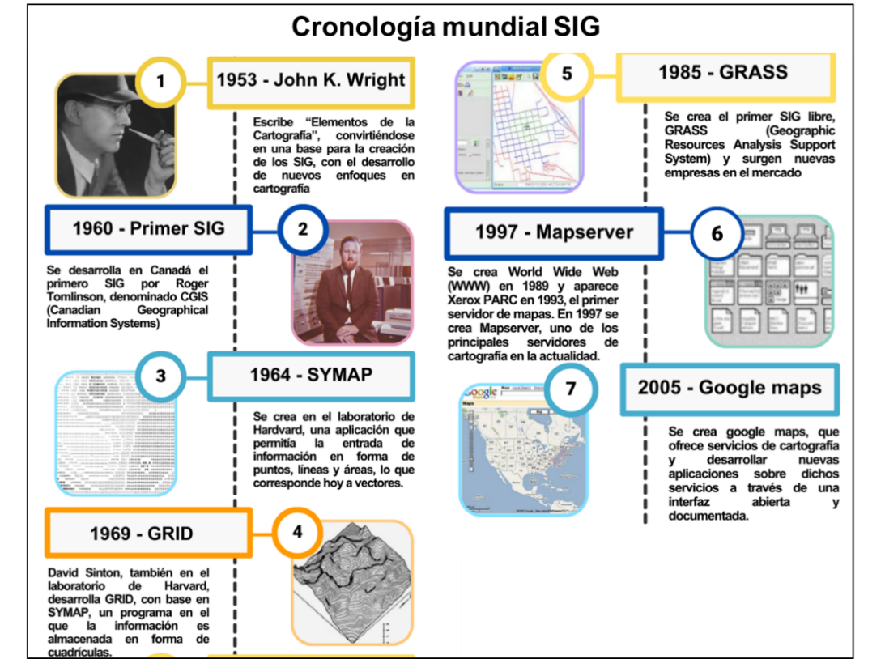
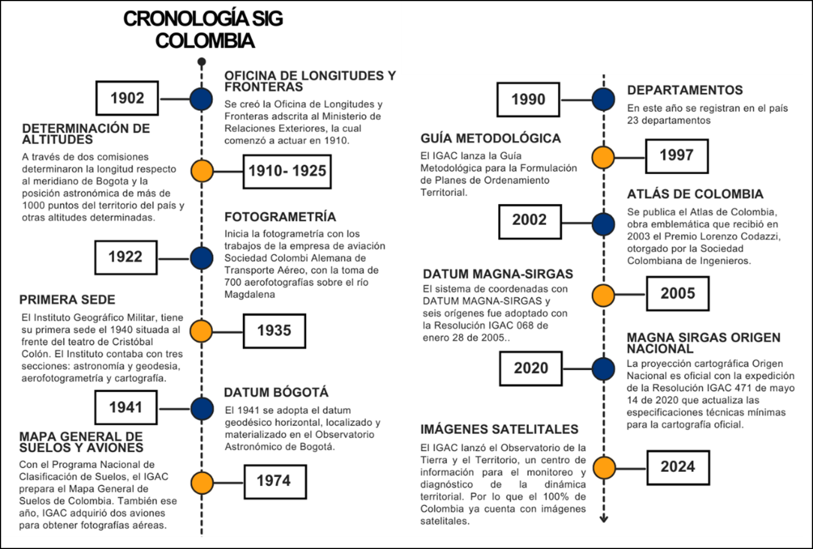

# Marco teórico de los SIG {.unnumbered}

## Definición SIG {.unnumbered}

Los SIG son conjuntos de herramientas integradas para capturar, almacenar, consultar, analizar y desplegar datos geoespaciales [@chang2015; @longley2015]. Los SIG son el núcleo de la tecnología geoespacial, que está relacionada con una serie de campos como la teledetección, Sistema de Posicionamiento Global (GPS), cartografía, topografía, geoestadística, programación, gestión de bases de datos y diseño gráfico [@heywood2011; @burrough1998]. Estas herramientas permiten combinar información gráfica y alfanumérica para generar productos como mapas, visores, modelaciones y bases de datos [@esri2013b].

Según la definición del IGAC (2005) los SIG son herramientas y actividades que actúan coordinada y sistemáticamente para recolectar, almacenar, validar, manipular, integrar, analizar, actualizar, extraer y desplegar información, tanto gráfica como descriptiva de los elementos considerados, con el fin de satisfacer múltiples propósitos.

## Contexto mundial {.unnumbered}

A nivel mundial, los SIG desempeñan un papel importante en diversas áreas, desde la planificación territorial y la gestión del medio ambiente hasta la gestión del riesgo de desastres y la toma de decisiones en el ámbito gubernamental y empresarial. Para comprender el contexto, se presenta el marco histórico.

### Marco histórico {.unnumbered}

Las bases de los SIG se sentaron a mediados del siglo XX con pioneros como John K. Wright y Waldo Tobler, quien en 1959 definió los principios de los sistemas de cartografía computarizada un sistema denominado MIMO (Map In, Map Out). El hito fundacional fue el desarrollo del Canadian Geographical Information Systems (CGIS) por Roger Tomlinson en la década de 1960, marcando el inicio formal de los SIG. Desde entonces, estas herramientas han experimentado una rápida evolución, pasando de sistemas aislados a plataformas colaborativas e interoperables, impulsadas por el avance tecnológico y el auge de la geografía voluntaria y la participación ciudadana [@williamson2003; @dangermond2019]. Esta evolución ha posicionado a los SIG como aliados estratégicos en la gestión del riesgo de desastres a nivel mundial, permitiendo la representación precisa de áreas de riesgo, el monitoreo en tiempo real, le ordenamiento territorial y la toma de decisiones basada en datos [@nrc2007; @esri2020a] como se evidenció en eventos críticos como el terremoto de Tohoku y el huracán Irene. En la @fig-cronologia-mundial-sig se evidencia la cronología mundial de los Sistemas de Información geográfica.

{#fig-cronologia-mundial-sig}

### Marco normativo {.unnumbered}

El marco normativo internacional de los SIG está compuesto por estándares y directrices que buscan garantizar la interoperabilidad, calidad, accesibilidad, privacidad y uso ético de la información geoespacial. Estos lineamientos promueven la colaboración internacional y el intercambio de buenas prácticas en el desarrollo y uso de los SIG.

Entre las normas internacionales que están relacionadas con los SIG, infraestructuras de datos espaciales y con metadatos, figuran varias normas del conjunto ISO 19100, entre esas las siguientes:

- **ISO 19115 (2003):** Estándar para describir metadatos de información geográfica, incluyendo identificación, calidad, referencia espacial y distribución.
- **ISO 19119 (2005):** Proporciona un marco para el desarrollo de servicios geográficos interoperables en entornos abiertos.
- **ISO 19128 (2005):** Define la implementación de servicios web de mapas (WMS) para la visualización dinámica de datos geográficos.
- **ISO 19139 (2007):** Establece esquemas XML para metadatos conformes a ISO 19115, facilitando el intercambio de información.
- **ISO 19115-2 (2009):** Extiende la norma 19115 para incluir datos ráster e imágenes geográficas.
- **ISO 19142 (2010):** Define los servicios web de entidades geográficas (WFS) para consulta y transferencia de datos vectoriales.
- **ISO 19118 (2011):** Especifica reglas de codificación para la interoperabilidad basada en esquemas UML.
- **ISO 19139-2 (2012):** Proporciona esquemas XML para la implementación de metadatos de datos ráster (extensión ISO 19115-2).

## Contexto nacional  {.unnumbered}

En Colombia, los SIG son fundamentales para la política de sistematización y acceso a la información, promoviendo el uso coordinado de datos geográficos generados por entidades como el IGAC, DANE y DNP. El IGAC, en particular, es la entidad rectora en la producción cartográfica oficial, la investigación geográfica y la coordinación de la Infraestructura Colombiana de Datos Espaciales (ICDE). Actualmente, los SIG son esenciales para el análisis espacial y la correlación de datos con localización geográfica, facilitando la planificación y el ordenamiento territorial a todos los niveles de decisión.

### Marco histórico {.unnumbered}

El desarrollo de los SIG en Colombia, impulsado por la evolución tecnológica y la necesidad de una planificación territorial adecuada, se remonta a 1902 con la creación del IGAC, entidad que desde entonces ha liderado la producción geográfica y cartográfica del país. A lo largo del siglo XX y principios del XXI, el IGAC ha marcado hitos como la instalación del Observatorio Geomagnético (1950), el intercambio de información con otras entidades (1984), la publicación de guías metodológicas para el POT (1997) y atlas digitales (2002), y la firma de acuerdos internacionales (2011). Recientemente, desde 2014, el IGAC ha modernizado su plataforma tecnológica con el lanzamiento del Portal Geográfico Nacional y otras herramientas como Colombia OT y Colombia en Mapas, consolidando los SIG como instrumentos esenciales para la formulación de políticas públicas, el desarrollo territorial y la gestión del riesgo de desastres a nivel nacional, en concordancia con la normatividad vigente.. En la @fig-cronologia-sig-colombia se resume la historia de los SIG en Colombia.

{#fig-cronologia-sig-colombia}

Actualmente, diversas entidades públicas en Colombia utilizan portales SIG y mecanismos de gestión de datos geoespaciales, lo que ha fortalecido la planificación, el control territorial, la gestión del riesgo y la toma de decisiones estratégicas, en concordancia con la normatividad vigente. Estos instrumentos se han consolidado como herramientas clave para la formulación de políticas públicas y el desarrollo territorial en distintas escalas [@igac2018b; @esri2020b].

### Marco normativo {.unnumbered}

En Colombia, la implementación de los SIG se rige por la normatividad estatal vigente en materia de divulgación de datos públicos y las regulaciones de uso que cada institución declara al usuario. Entre las normas y documentos pertinentes figura: la Ley 1523 de 2012 y los documentos 3585 de 2009 y el 3762 de 2013.

INVEMAR. (s.f.). Geoportal INVEMAR [nota: falta URL específica citada en el documento original; verificar con el autor de la figura]. Instituto de Investigaciones Marinas y Costeras "José Benito Vives de Andréis".

- **Ley 1523 de 2012** – Por la cual se adopta la Política Nacional de Gestión del Riesgo de Desastres y se establece el Sistema Nacional de Gestión del Riesgo de Desastres (SNGRD). En su Capítulo IV, Artículo 45, dispone que la UNGRD debe implementar un Sistema Nacional de Información para la Gestión del Riesgo de Desastres, en concordancia con la infraestructura colombiana de datos espaciales, integrando contenidos de entidades nacionales y territoriales para fomentar la generación, uso y actualización continua de la información sobre riesgo y emergencias.
- **Ley 1712 de 2014** – Ley de Transparencia y del Derecho de Acceso a la Información Pública. Obliga a las entidades públicas a publicar información de interés, incluyendo datos geográficos, y promueve la creación de portales de datos abiertos.
- **Decreto 1077 de 2015** – Decreto Único Reglamentario del Sector Vivienda, Ciudad y Territorio. Incluye disposiciones para el uso de herramientas SIG en los procesos de planificación, ordenamiento territorial y gestión del riesgo, así como la producción y análisis de información cartográfica y geoespacial en la elaboración de POT.
- **Decreto 2613 de 2013** – Organización del IGAC como gestor de la ICDE. Designa al IGAC como coordinador nacional de la ICDE, estableciendo principios de interoperabilidad, estandarización y acceso a información geoespacial para facilitar la articulación institucional.
- **Decreto 1280 de 2003** – Política de Información Geográfica. Define los lineamientos generales para la generación, acceso, uso y estandarización de datos geográficos, buscando evitar duplicidades y promover la eficiencia en la producción de información espacial.
- **Decreto 1070 de 2015** – Decreto Único Reglamentario del Sector TIC. Establece principios para la gestión de la información pública, incluyendo los datos geográficos en el marco de los sistemas de información del Estado.
- **CONPES 3585 de 2009** – Política Nacional de Información Geográfica. Establece los lineamientos para consolidar la **Infraestructura Colombiana de Datos Espaciales (ICDE)**, regulando la producción, documentación, acceso y uso de la información geográfica generada por entidades estatales, bajo principios de interoperabilidad, estandarización y disponibilidad (WMS, WFS, etc.).
- **CONPES 3859 de 2016** – Política para la adopción e implementación de un catastro multipropósito rural-urbano. Establece que el IGAC, en coordinación con el DNP, liderará el desarrollo del Portal Geográfico Nacional (Colombia en Mapas), como plataforma unificada para la gestión de la información geográfica oficial del país, en el marco de la ICDE.
- **Plan Nacional de Desarrollo 2022–2026 y normas sectoriales.** Promueve la transformación digital del Estado y el fortalecimiento de plataformas geoespaciales. Normas como el Decreto 1807 de 2014 (gestión del riesgo) y la Resolución 839 de 2017 (ambiental) incluyen el uso obligatorio o recomendado de SIG en sus procesos.
- **Otras fuentes técnicas relevantes.** Incluyen guías y lineamientos del IGAC sobre estándares de metadatos, escalas cartográficas y catastro; así como documentos técnicos del DNP y la UNGRD sobre el uso de SIG en planificación y gestión del riesgo.

