# Usos y aplicaciones de los SIG {.unnumbered}

Las áreas de uso práctico de los SIG abarcan varios sectores; desde un inventario de los recursos naturales y humanos hasta el control y la gestión de datos catastrales urbanos y rurales a través del catastro multipropósito y en la planificación y gestión urbana [@igac2018a; @williamson2010]. Además, son esenciales para la cartografía y el monitoreo de grandes instalaciones, como redes telefónicas, sistemas de abastecimiento y evacuación de aguas y las redes de transporte [@longley2015; @esri2013a; @heywood2011]

Se requieren también en sectores como el bancario, sanitario, logístico de transporte, las telecomunicaciones, movilidad vial, el medio ambiente y el geológico minero (Pindo, 2007). En resumen, un sistema de información geográfica es útil en cualquier área donde sea necesario el manejo de información espacial (Bosque, 2000) brindando apoyo a diversas funciones y procesos. Ver @fig-funciones-sig.

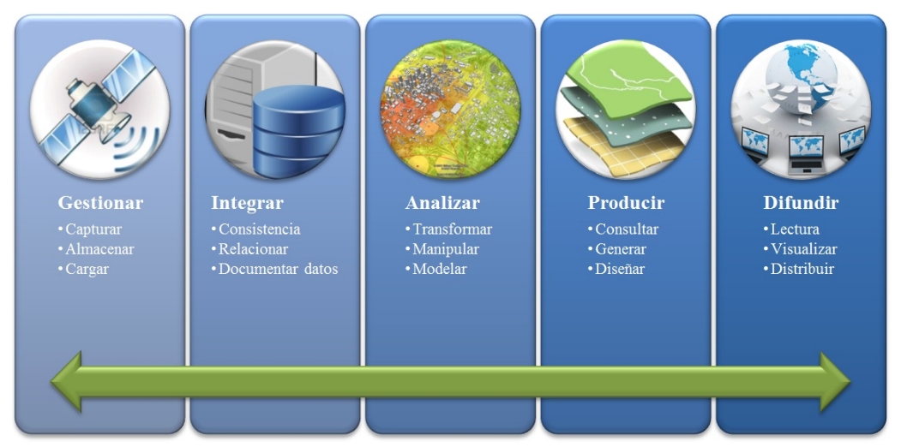{#fig-funciones-sig}

## Conceptos básicos de los SIG {.unnumbered}

Para elaborar insumos con SIG, se requiere conocer una serie de conceptos previos necesarios para realizar y comprender correctamente las operaciones. En este capítulo, se presentan algunos conceptos básicos de los SIG, geodesia y cartografía.

### Componentes básicos de los SIG {.unnumbered}

Son cinco los elementos principales que conforman un SIG: datos, métodos, software, hardware y factor organizativo o personal (Esri, 2003). Ver @fig-componentes-sig.

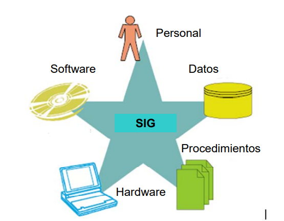{#fig-componentes-sig}

#### 3.1.1.1. Formato de Datos:  

Son una representación simbólica (numérica, alfabética, espacial, etc.) de un atributo o variable cuantitativa o cualitativa (Ministerio de Educación, 2021). Existen dos tipos de datos vectorial (puntos, líneas y polígonos) o raster (basado en cuadrículas). Ver la @fig-raster-vector.

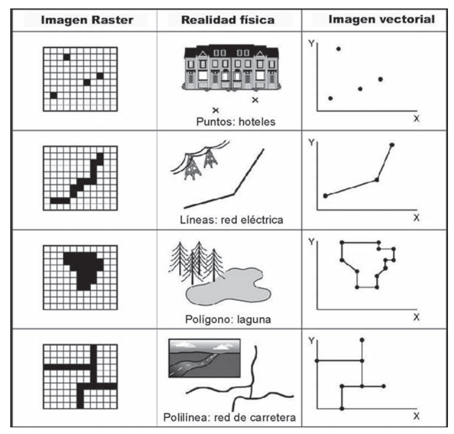{#fig-raster-vector}

A continuación, se hará la descripción de los modelos teniendo como base las definiciones enunciadas en el trabajo de Santos y Cocero, (2008):

**Modelo r****aster:** el espacio está dividido en celdas (píxeles), de manera que cualquier información del mundo real se codifica sobre este formato espacial, al sobreponer la retícula o malla sobre el territorio. A través de un sistema de referencia apropiado, se establecería una relación biyectiva entre las celdas de una cuadrícula y un conjunto de áreas elementales de la superficie terrestre. 

El modelo raster estructura la información temática, individualmente, para cada uno de los atributos. De esta manera, la información se almacenaría en capas independientes, para cada una de las variables a representar. La @fig-capas-tematicas-raster muestra la forma de organizar la información de un territorio determinado, mediante capas que recogen la variación espacial de la altitud, usos del suelo, litología, pendiente del terreno, orientación, etc. 

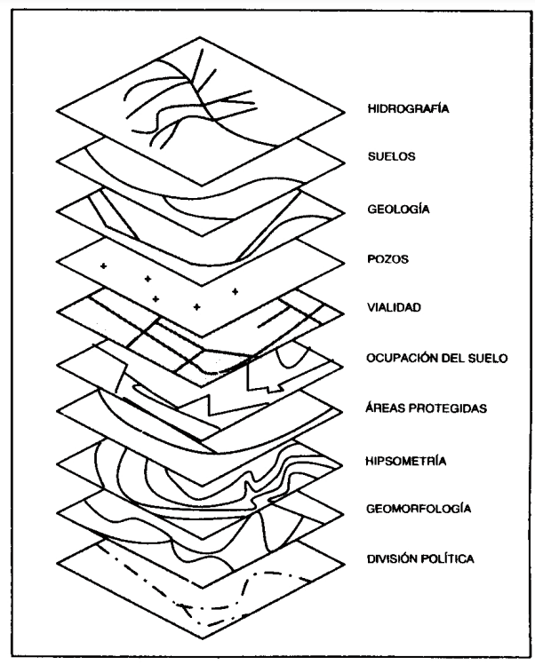{#fig-capas-tematicas-raster}

Los datos geográficos del mundo real quedan representados, de acuerdo a la correspondencia de las figuras geométricas elementales planas y el formato raster. Así, los elementos puntuales serían reemplazados por celdas individuales, los lineales por una secuencia de celdas alineadas y los polígonos por celdas contiguas del mismo valor temático. Ver @fig-objetos-geograficos-raster.

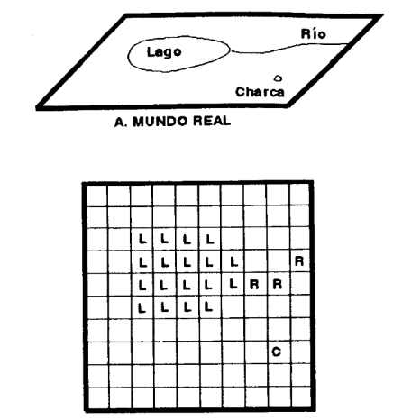{#fig-objetos-geograficos-raster}

**Modelo vectorial**: En el modelo vectorial, los elementos geográficos lo constituyen: puntos, líneas y polígonos, implica el posicionamiento relativo de los mismos en el espacio. La forma natural de reflejar esta situación es la geocodificación de las entidades espaciales, respecto a unos ejes de coordenadas. Los puntos, como objetos adimensionales, quedarían representados por un par de coordenadas (x, y). Las líneas y polígonos se construirían a partir de estas unidades elementales, ya que constituyen, bien una sucesión abierta de puntos, en el caso de las líneas, o una sucesión de puntos que cierra el espacio, donde las coordenadas del primero y del último de los puntos coinciden, en el caso del polígono. Ver @fig-elementos-vectoriales.

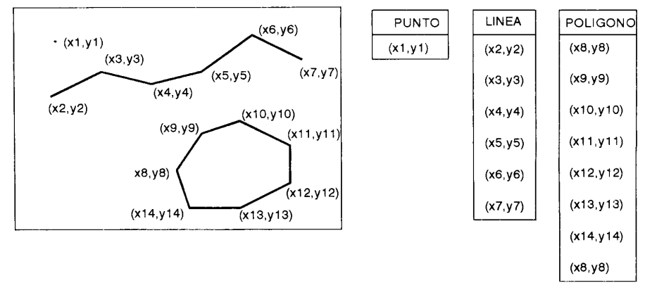{#fig-elementos-vectoriales}

En el modelo vectorial, es importante diferenciar las estructuras de datos cartográficas y topológicas. Las primeras manifiestan, exclusivamente, la forma y posición de los objetos espaciales, por lo que la expresión de los puntos, líneas y polígonos, por sus coordenadas respectivas, es suficiente para definirlos. La estructura topológica define, bien la conectividad de los arcos en las intersecciones, bien las relaciones de contigüidad entre polígonos.

#### 3.1.1.2. Software y Hardware:

Un SIG debe tener un sistema computarizado, una computadora u ordenador que se concibe como «una máquina capaz de aceptar unos datos de entrada, efectuar con ellos operaciones lógicas y aritméticas y proporcionar la información resultante a través de un medio de salida (Santos, 2004). Todo ello, sin intervención de un operador humano y bajo el control de un programa de instrucciones previamente almacenado en la propia computadora (Pedrera Carvajal, A. y Sánchez Figueroa, F., 1997 en Santos, 2004). Desde este punto de vista (tecnológico), son dos los componentes que resultan esenciales para el uso de los sistemas de información geográfico: el software y el hardware. 

- **Hardware:** corresponde al soporte físico de la informática, es decir, el conjunto de circuitos electrónicos, cables, armarios, dispositivos electromecánicos y otros elementos físicos (Santos, 2004). 

- **Software:** por su parte, como soporte lógico, es decir, la programación (instrucciones y datos) necesaria para que el equipo informático realice la función requerida, unos de los ejemplos de software más usados en la actualidad son ArcGis y QGis.
  - **ARCGIS (Esri):** es un software con licenciamiento, costos académicos y costos empresariales que permite recopilar, administrar, analizar y compartir información geográfica.
  - **QGIS:** es un software libre y gratuito, sin restricción para proyectos empresariales, posibilita la creación, visualización, análisis y publicación de información geoespacial. Permite conexión con servicios WMS y WFS.

Con el fin de que los equipos encargados de la gestión del riesgo de desastres en los municipios puedan elaborar su propia cartografía básica, útil para la toma de decisiones, este documento incluye el paso a paso para construir dichos insumos utilizando el software QGIS, ya que es de acceso libre, y puede ser utilizado e todos los territorios. 

### 3.1.2. Modelo Digital de Elevación (DEM) {.unnumbered}

Un Modelo Digital de Elevación (DEM) representa la altitud del terreno respecto al nivel del mar, sin incluir elementos construidos o naturales presentes sobre la superficie, como edificios, árboles o postes [@chang2015; @li2005]. Este modelo del terreno es ampliamente utilizado en estudios hidrológicos para el delineamiento de cuencas, análisis de acumulación y dirección del flujo, así como en estudios de suelos y planificación del uso del suelo [@wilson2000; @burrough1998; @usgs2020]. 

Los métodos más utilizados para recolectar información necesaria para la creación de los DEM, son principalmente métodos de teledetección, como:

- Interferometría de Satélite
- Fotogrametría
- LIDAR
- Radar terrestre
- Topografía

Las principales fuentes de descarga son: 

a) **Repositorio USGS SRTM 30m:** [https://earthexplorer.usgs.gov/](https://earthexplorer.usgs.gov/)
b) **ALOS-PALSAR (L) 12,5 m:** [https://search.asf.alaska.edu/](https://search.asf.alaska.edu/)
c) **Repositorio ESA SRTM 30m:** [http://step.esa.int/auxdata/dem/SRTMGL1/](http://step.esa.int/auxdata/dem/SRTMGL1/)
d) **SRTM 90m:** [https://srtm.csi.cgiar.org/srtmdata/](https://srtm.csi.cgiar.org/srtmdata/)

### 3.1.3. Modelo Digital de Superficie (DMS) {.unnumbered}

El Modelo Digital de Superficie (DMS) representa las altitudes de todos los objetos que se encuentran sobre la superficie terrestre, incluyendo copas de árboles, techos de edificios, torres y líneas eléctricas [@esri2020c; @li2005]. Este modelo es ampliamente utilizado en aplicaciones de modelado 3D, como telecomunicaciones, planificación urbana y navegación aérea, ya que permite identificar obstáculos y estructuras elevadas [@sithole2004].

### 3.1.4. Modelo Digital de Terreno (DTM) {.unnumbered}

Por su parte, el Modelo Digital de Terreno (DTM) representa de forma más detallada las características topográficas del terreno, ya que se deriva del DEM e incorpora elementos como líneas de cresta, canales de drenaje o líneas de ruptura [@felicisimo1994; @wilson2000]. Se estructura normalmente como una red de puntos vectoriales distribuidos regularmente, con atributos que permiten enriquecer el análisis espacial [@burrough1998]. En la @fig-diferencia-dms-dem-dtm se observa la diferencia de los modelos digitales.

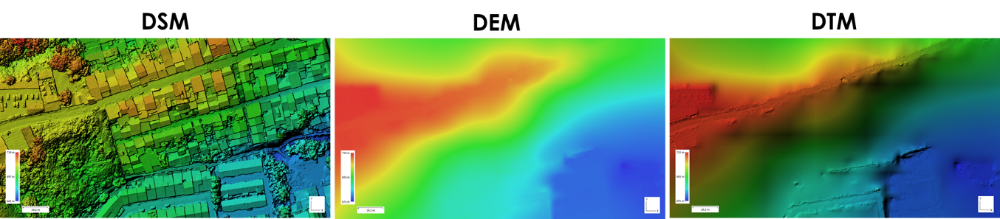{#fig-diferencia-dms-dem-dtm}

### 3.1.5. Servicios web geográficos  {.unnumbered}

La interoperabilidad entre sistemas heterogéneos se define como la capacidad para ejecutar programas y transferir datos entre diferentes unidades funcionales  este objetivo se logra principalmente con la implementación de servicios web. 

Open Geospatial Consortium (OGC) un consorcio mundial para el consenso de estándares relacionados con la gestión de información geográfica, definió el *Web **Map Service* (WMS), *Web Feature Service* (WFS) y *Web Coverage Service* (WCS) para compartir datos, vector, raster e imágenes de mapas respectivamente.. Estos estándares son adoptados por SIG como ArcGis, MapWindow, Google Earth, NASA World Wind y portales como Google maps y Yahoo maps permitiendo la interoperabilidad.

- **Web Map Service (WMS):** es un servicio renderizado, que proporciona una interfaz HTTP (HyperText Transfer Protocol) para el uso de imágenes de mapas registrados desde una o más bases de datos geoespaciales. Las operaciones WMS se pueden extraer y utilizar desde un navegador estándar mediante un URL (HyperText Transfer Protocol)

- **Web Feature Service (WFS):** define la interfaz de implementación y las operaciones para la consulta y edición de entidades geográficas o features, como carreteras o líneas de contorno de cuerpos de agua o divisiones políticas.

- **Web Coverage Service (WCS):** proporciona la interfaz de implementación y las operaciones que permiten el acceso interoperable a coberturas geoespaciales. El término cobertura se refiere a contenidos de imágenes de satélite, fotos aéreas, datos digitales de elevación, entre otros. La respuesta a una solicitud WCS incluye metadatos de la cobertura y la cobertura como tal, cuyos pixeles se almacenan en un formato binario específico, como GeoTIFF o NetCDF

## 3.2. Fundamentos cartográficos  {.unnumbered}

La información georreferenciada se caracteriza por estar asociada a una ubicación específica en la superficie terrestre, expresada mediante coordenadas dentro de un sistema de referencia espacial [@chang2015; @iliffe2008]. La precisión en esta localización depende de la geodesia, ciencia que estudia la forma y dimensiones de la Tierra, la cual no es perfectamente esférica, sino que se aproxima a un elipsoide achatado en los polos [@hofmannwellenhof2005; @snyder1987].

En este contexto, se utilizan dos superficies de referencia: el elipsoide, una figura matemática ideal que modela la forma general del planeta, y el geoide, una superficie equipotencial del campo gravitacional terrestre, más representativa del nivel medio del mar [@schwarz1990] (IGAC, 2021). Ver @fig-tierra-geoide-elipsoide.

El conjunto formado por el elipsoide y un punto de tangencia con la superficie terrestre forma un ***datum ***

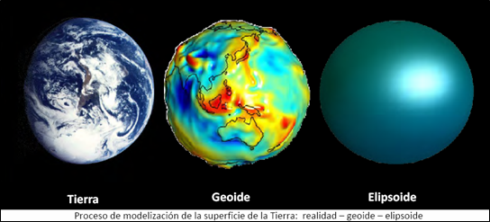{#fig-tierra-geoide-elipsoide}

Otro aspecto importante al trabajar con un SIG es el uso de proyecciones cartográficas, que permiten representar la superficie curva de la Tierra en un plano mediante modelos matemáticos. Estas proyecciones transforman coordenadas geográficas (esféricas o elipsoidales) en coordenadas planas, lo que es fundamental para la elaboración precisa de mapas [@snyder1987; @iliffe2008].

Los elementos de la geodesia —como el sistema de referencia y el datum geodésico— junto con las proyecciones cartográficas, hacen posible la producción de cartografía a partir de información georreferenciada [@chang2015; @burrough1998]. 

## 3.3. Sistemas de coordenadas {.unnumbered}

El IGAC define un sistema de coordenadas como el conjunto de parámetros que permiten definir inequívocamente la posición de cualquier punto en un espacio geométrico respecto de un punto denominado origen sobre la superficie terrestre. 

Para asignar coordenadas a un punto en función de los elementos anteriores es necesario definir un **sistema de referencia**. Las coordenadas geográficas han sido utilizadas tradicionalmente, y son de utilidad para grandes zonas. Sin embargo, las coordenadas cartesianas resultan más intuitivas y prácticas al momento de generar ciertos productos, a raíz de esto surgen las **proyecciones cartográficas** definidas como el método que representa la superficie curva de la tierra sobre un plano, que son los que se emplean para la creación de la cartografía.

**3.3.1. Sistema de Coordenadas Geográficas:** es el sistema de referencia para localizar elementos espaciales en la superficie terrestre. Está definido por las medidas angulares: longitud y la latitud. La primera mide el ángulo este u oeste desde el primer meridiano y la segunda mide el ángulo norte o sur del plano ecuatorial. Las unidades son angulares, generalmente en grados. Ver @fig-coordenadas-geograficas.

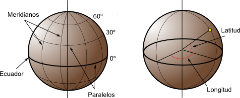{#fig-coordenadas-geograficas}

## 3.4. Proyección cartográfica en Colombia {.unnumbered}

Una proyección cartográfica es un método que transforma las coordenadas geográficas (latitud y longitud) en coordenadas planas (X,Y) sobre un plano, lo que permite representar la superficie curva de la Tierra en mapas ya sea en papel o digital. En Colombia, antes del actual sistema MAGNA-SIRGAS Origen Nacional, el país aplicaba el *Datum Bogotá* adoptado en 1941 y el sistema MAGNA-SIRGAS de seis orígenes adoptado en el 2005 y asociado a una proyección Transversa de Mercator de tipo *tangente*, mientras actualmente es de tipo ***secante*** **(IGAC, 202****0****)****.**

A continuación, en la @fig-cronologia-igac-2005-2020 se evidencia la cronología de las resoluciones técnicas en producción de información georreferenciada según el IGAC desde el año 2005 hasta el año 2020.

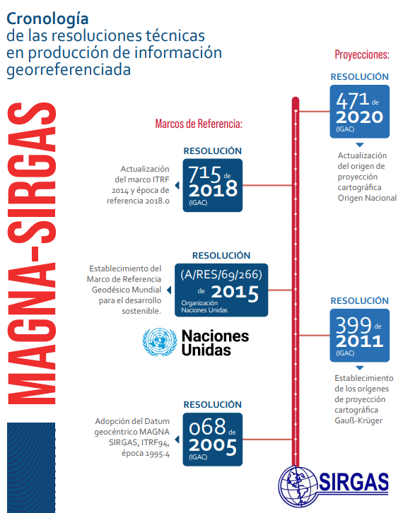{#fig-cronologia-igac-2005-2020}

Si bien no existe un método perfecto de proyección, la definición de un sistema de proyección de origen nacional en Colombia, busca garantizar la homogeneidad y continuidad en la representación de los elementos del territorio, así como facilitar los trabajos relacionados con la gestión de coordenadas en el país . Por este motivo, mediante la Resolución 388, actualizada con la Resolución 509, la Resolución 471 actualizada con la Resolución 529, expedidas en el año 2020 por el Instituto Geográfico Agustín Codazzi - IGAC, reglamenta el uso de un nuevo Origen de Proyección Cartográfica: **MAGNA SIRGAS - ORIGEN NACIONAL CTM-12** para la gestión, integración y uso de la información de la Cartografía Básica para fines oficiales. 

Al sistema Origen Nacional se le conoció al principio como CTM12, ya que se planteó referida a una banda continental con un ancho de 12º de longitud, pero su nombre oficial es MAGNA-SIRGAS Origen-Nacional. El Datum que usa el sistema sigue siendo Marco Geodésico Nacional, MAGNA-SIRGAS, es decir el mismo que se usaba antes cuando eran seis orígenes.

Mediante la Resolución IGAC 370 de 2021 se establece la proyección cartográfica “Transversa Mercator” como sistema oficial de coordenadas planas para Colombia, con el único origen denominado “Origen Nacional» referido al Marco Geocéntrico Nacional de Referencia, MAGNA SIRGAS. Ver @fig-origen-nacional-puerto-lopez.

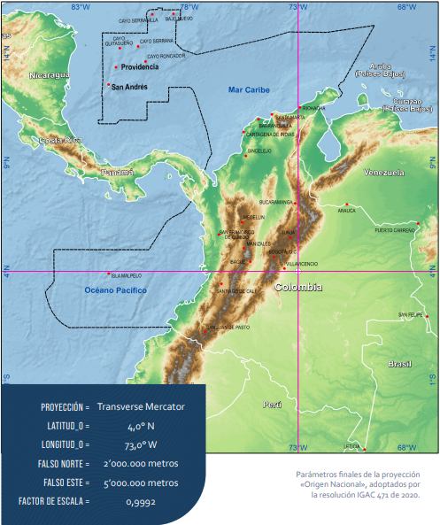{#fig-origen-nacional-puerto-lopez}

**El nuevo sistema debe ser adoptado para todas aquellas entidades que produzcan, usen o compartan información geográfica oficial y/o pretendan representar sus datos sobre cartografía IGAC**. El proceso de transición por parte de las instituciones al uso de la proyección de origen nacional se debe realizar de manera paulatina.

El IGAC actualizó su aplicativo de conversión MAGNA SIRGAS a su versión 5.1 que incorpora usa el Origen único nacional. Se puede descargar el instalador e instructivo de instalación en [https://origen.igac.gov.co/herramientas.html](https://origen.igac.gov.co/herramientas.html).

**3.4.1. MAGNA PRO:** es un software o aplicación del IGAC, que permite emplear los parámetros de transformación oficiales, conversión, cálculo de ondulación, cálculo de velocidades y tranformación entre el antiguo Datum Bogotá y el actual Marco Geocéntrico Nacional de Rederencia (MAGNA-SIRGAS)

Link de acceso: 
[https://antiguo.igac.gov.co/es/noticias/igac-presenta-la-nueva-version-magna-sirgas-pro-42](https://antiguo.igac.gov.co/es/noticias/igac-presenta-la-nueva-version-magna-sirgas-pro-42)

