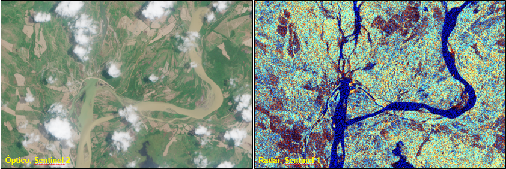
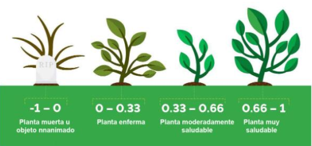
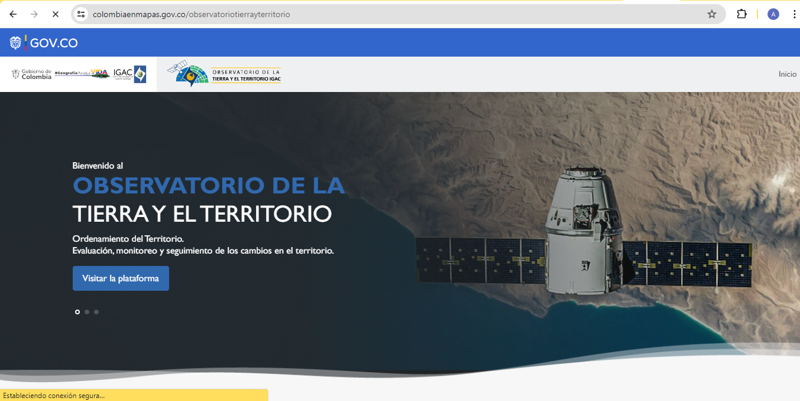
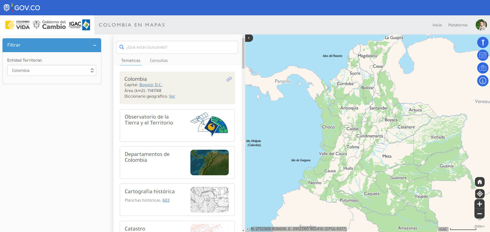
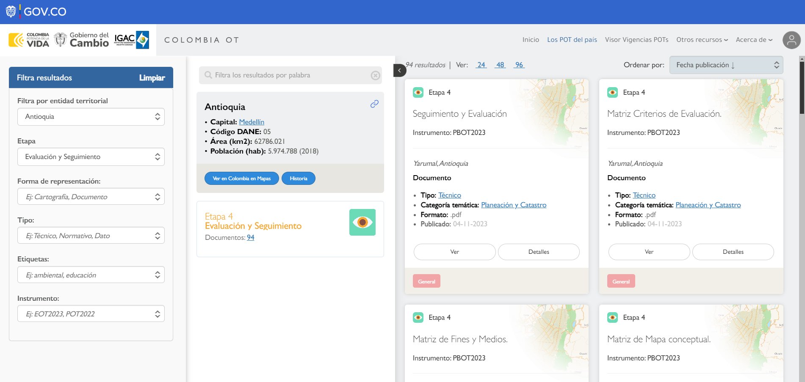
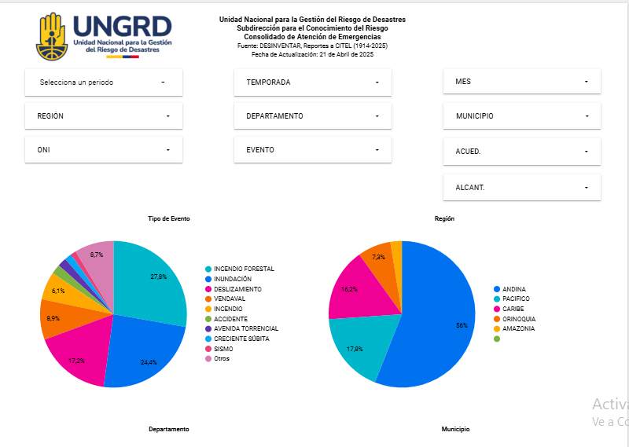
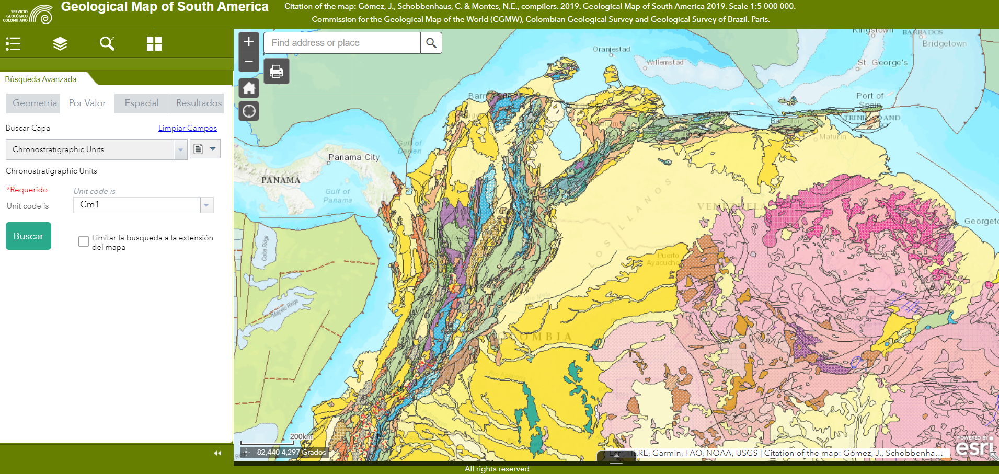
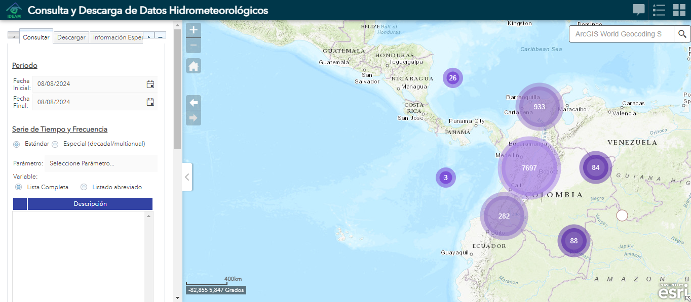
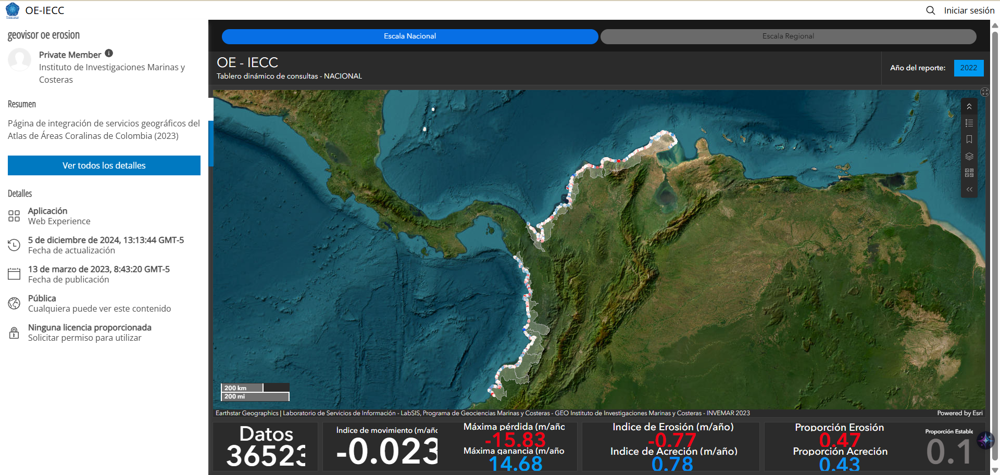
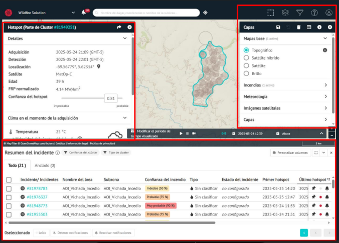

# Fuentes de información {.unnumbered}

En el contexto de los SIG, las fuentes de información juegan un papel clave al proporcionar la base de datos espaciales sobre la cual se elaboran mapas y análisis. Existen múltiples fuentes gratuitas disponibles para los municipios, que incluyen imágenes satelitales ópticas y de radar, modelos digitales de elevación (DEM), modelos de superficie (DSM) y modelos del terreno (DTM) [@lillesand2015; @campbell2011].

La teledetección permite monitorear la superficie terrestre mediante sensores a bordo de satélites, que capturan imágenes en distintas longitudes de onda del espectro electromagnético. Las imágenes ópticas registran energía reflejada, siendo útiles para detectar vegetación y humedad, mientras que los radares activos (como Sentinel-1) capturan información en condiciones de nubosidad o sin luz [@esa2022; @copernicus2021]. Ver @fig-imagenes-opticas-radar.

{#fig-imagenes-opticas-radar}

Además, plataformas SIG modernas permiten acceder a datos mediante servicios web interoperables como WMS (Web Map Service), WFS (Web Feature Service) y WCS (Web Coverage Service), que facilitan la visualización y análisis de datos geoespaciales desde servidores remotos [@esri2020d].

Herramientas como Google Earth, QGIS, ArcGIS Online y TerriaJS permiten integrar estos servicios y explorar información geográfica de forma interactive. Geoportales como EarthExplorer [@usgs2021], Copernicus Open Access Hub [-@copernicus2021] y la ICDE en Colombia (IGAC, 2022) ofrecen acceso libre a este tipo de información.

## 4.1. Imágenes satelitales ópticas gratuitas  {.unnumbered}

- **LANDSAT:** Serie de satélites de órbita polar y captura de imágenes multiespectrales, desarrollados por la NASA y el Servicio Geológico de los Estados Unidos (USGS) empleados para:
  - El inventario de la cobertura y el uso de suelo
  - La exploración geológica y mineralógica
  - La evaluación de cultivos y explotaciones forestales
  - La urbanización
  - La monitorización de cambios en la cobertura del suelo a corto y largo plazo

Los satélites Landsat proporcionan un registro continuo de cobertura de la Tierra de resolución media, que se remonta a 1972; la frecuencia de revisita es de 16 días.

- **Link Landsat visualizador:** [https://glovis.usgs.gov/](https://glovis.usgs.gov/)
- **Link Landsat descarga de datos:** [https://earthexplorer.usgs.gov/](https://earthexplorer.usgs.gov/)

- **SENTINEL 2:** Comprende una constelación de dos satélites en órbita polar colocados en la misma órbita heliosíncrona, en fase de 180° entre sí. Su objetivo es monitorear la variabilidad en las condiciones de la superficie terrestre y su amplio ancho de franja (290 km) y tiempo de revista alto (10 días en el ecuador con un satélite y 5 días con 2 satélites en condiciones libres de nubes, lo que resulta en 2-3 días en latitudes medias) apoyará el seguimiento de los cambios en la superficie de la Tierra. Los datos de observación de la misión SENTINEL-2 se utilizarán en servicios como:
  - Monitoreo de la tierra
  - Gestión de emergencias
  - Seguridad
  - Cambio climático
  - Marina

- **PLANETSCOPE:** Es una constelación de aproximadamente 130 satélites, capaz de obtener imágenes de toda la superficie terrestre de la Tierra todos los días (una capacidad de recolección diaria de 200 millones de km²/día). Las imágenes de PlanetScope tienen una resolución de aproximadamente 3 metros por píxel.

PlanetScope permite mediante el índice diferencial de vegetación normalizado (NDVI), generar una imagen que muestra el color verde o biomasa relativa, que aporta valores en -1.0 y 1.0, lo que permite la categorización de la cobertura vegetal. Ver @fig-ndvi.

{#fig-ndvi}

- **Link de acceso:** [https://developers.planet.com/docs/data/planetscope/](https://developers.planet.com/docs/data/planetscope/)

## 4.2. Imágenes satelitales de radar gratuitas {.unnumbered}

- **SENTINEL 1:** La misión Sentinel-1 comprende una constelación de dos satélites (1A/1B) en órbita polar, que operan día y noche y realizan imágenes de radar de apertura sintética de banda C, lo que les permite adquirir imágenes independientemente del clima. Permiten:
  - El monitoreo terrestre de bosques, agua, suelo y agricultura
  - El soporte de mapeo de emergencia en caso de desastres
  - La producción de mapas de hielo de alta resolución
  - El mapeo de derrames de petróleo
  - Monitoreo del cambio climático

**Link Sentinel visualizador:** [https://sentinels.copernicus.eu/web/sentinel/home](https://sentinels.copernicus.eu/web/sentinel/home)

- **TERRASAR-X:** es un satélite de radar de observación de la Tierra, se desplaza sobre una órbita polar, crepuscular y heliosíncrona a 514 km de altitud. Proporciona imágenes de radar con una resolución de hasta 1m, con independencia de las condiciones meteorológicas y lumínicas. Algunas de las aplicaciones de las imágenes de radar TerraSAR-X son:
  - Cartografía topográfica a escalas hasta de 1:25.000
  - Movimiento de superficie provocados por minería, construcción de infraestructuras o ingeniería subterránea
  - Cobertura del suelo
  - Respuesta inmediata en caso de emergencias, por ejemplo, terremotos, inundaciones, movimientos en masa, entre otros
  - Aplicaciones de supervisión de bosques, inundaciones o calidad del agua
  - Aplicaciones para ciencias como hidrología, geología, climatología, oceanografía entre otras

## 4.3. Imágenes satelitales de alta resolución {.unnumbered}

Las imágenes satelitales de alta resolución hacen referencia a precisiones menores de 1 metro por píxel. Muy alta resolución son imágenes de menos de 30 cm por píxel, lo que permite una mejor visualización y acciones como:

- Observar cambios en la vegetación
- Actualizaciones meteorológicas en tiempo real
- Gestionar campañas de exploración

En Colombia las imágenes satelitales de alta resolución se pueden descargar de forma gratuita en la plataforma del IGAC llamada Colombia en Mapas, en el ítem: Observatorio de la Tierra y el Territorio.

**Link de acceso:** [https://www.colombiaenmapas.gov.co/observatoriotierrayterritorio](https://www.colombiaenmapas.gov.co/observatoriotierrayterritorio)

{#fig-portal-descarga-alta-resolucion}

## 4.4. Geoportales disponibles {.unnumbered}

Actualmente, son varias las entidades públicas colombianas que utilizan datos geográficos y han desarrollado portales SIG para el manejo de su información geográfica. A continuación, se encuentra el link de algunos portales.

### Colombia en Mapas {.unnumbered}

Herramienta web interactiva que dispone a la ciudadanía diferentes productos de información georreferenciada que produce el IGAC. 

**Links de acceso:** [https://www.colombiaenmapas.gov.co](https://www.colombiaenmapas.gov.co) | [https://geoportal.igac.gov.co/](https://geoportal.igac.gov.co/)

En la sección de: Temáticas, puede encontrar información como: 

- Observatorio de la Tierra y el Territorio
- Departamentos de Colombia
- Cartografía histórica
- Catastro
- Cartografía básica
- Imágenes
- Gestión del riesgo
- Ordenamiento territorial

Además, esta plataforma ofrece herramientas de construcción de mapas a diferentes escalas incorporando las capas de la cartografía básica. Para visualizar capas de interés, tenga en cuenta los siguientes pasos:

1) Opción filtrar por entidad territorial; a nivel nacional, departamental o municipal. 
2) Palabras clave de la capa temática a encontrar en la opción “buscar.” 
3) Selección de resultados y descarga de la capa en formato seleccionado.

{#fig-geoportal-colombia-en-mapas}

### Colombia OT {.unnumbered}

Colombia OT es el espacio que ha pensado el IGAC para que se construya el territorio. Esta plataforma es el punto de partida, consulta y llegada de quienes necesitan los instrumentos que orientan el desarrollo, la transformación, la ocupación y vocación, del territorio habitado. Colombia OT, es el punto de encuentro para empoderar y alinear a los entes territoriales en su tarea político - administrativa de gestionar la planeación física y afianzar la identidad dentro de sus límites competentes. 

En esta plataforma se pueden visualizar los siguientes ítems directamente relacionados al ordenamiento territorial: 

- OT del país.
- Ruta de los Planes de Ordenamiento Territorial (POT).
- Datos para el OT.
- Normatividad OT.
- Cartillas, guías y manuales.
- Caracterizaciones territoriales.

**Link de acceso:** [https://www.colombiaot.gov.co/pot/buscador.html](https://www.colombiaot.gov.co/pot/buscador.html)

Para visualizar capas de interés, tenga en cuenta los siguientes pasos:

1) Opción filtrar por entidad territorial; a nivel nacional, departamental o municipal. 
2) Palabras clave de la capa temática de ordenamiento territorial encontrar en la opción “buscar.” 
3) Selección de resultados de acuerdo a su fase o etapa, y visualización y descarga de la capa o documento en formato seleccionado.

{#fig-portal-colombia-ot}

### Visor consolidado de atención a emergencias UNGRD {.unnumbered}

Con el fin de consolidar el inventario de atención de emergencias a nivel nacional, la UNGRD ha construido a partir del consolidado de atención de emergencias [@ungrd2023] y el Inventario histórico nacional de desastres (Corporación OSSO, 2019) el Inventario de atención de emergencias en el territorio colombiano. 

En este inventario es posible filtrar la información por temporada, departamento, municipio, tipo de evento, entre otros criterios. Además, se encuentran gráficas estadísticas que facilitan el análisis y comprensión de los datos registrados.

**Link de acceso:** [https://lookerstudio.google.com/reporting/a850fdeb-1229-4623-8a35-13895d4ec484](https://lookerstudio.google.com/reporting/a850fdeb-1229-4623-8a35-13895d4ec484)

{#fig-consolidado-atencion-emergencias}

### Geoportal del Servicio Geológico Colombiano (SGC) {.unnumbered}

El objetivo del Geoportal del SGC es mostrar información generada por las direcciones de: Geociencias Básicas, Recursos Minerales, Geoamenazas, Gestión de Información de la entidad, Información Petrolera y Laboratorios.

La información está almacenada en una geodatabase (GDB) corporativa y administrada sobre Oracle con aplicaciones web personalizadas utilizando Geoportal Server de ESRI. El portal cumple con estándares de código abierto (open source) como los Web Map Service (WMS), Web Feature Service (WFS), Web Coverage Service (WCS) y servicios Representational State Transfer (REST).

**Link de acceso:** [https://srvags.sgc.gov.co/jsviewer/GMSA/](https://srvags.sgc.gov.co/jsviewer/GMSA/)

{#fig-geoportal-sgc}

### Motor de Integración de Información Geocientífica (MIIG) del Servicio Geológico Colombiano {.unnumbered}

Es una herramienta que integra por medio de metadatos el contenido misional disponible en el Servicio Geológico Colombiano esto es la información almacenada en el SIG, Contenidos Documentales, tipo Web y otros sistemas misionales. A través del MIIG los usuarios internos y externos pueden realizar búsquedas inteligentes y descargar los contenidos de información en temas relacionados con Geociencias Básicas, Recursos Minerales, Amenazas Geológicas, Recursos Hidrocarburíferos, Tecnología Nucleares y Caracterización de Materiales Geológicos.

**Link de acceso:** [https://miig.sgc.gov.co/Paginas/advanced.aspx](https://miig.sgc.gov.co/Paginas/advanced.aspx)

### Sistema de Información de Movimientos en Masa–SIMMA {.unnumbered}

Sistema que permite cargar, administrar y consultar los movimientos en masa que ocurrieron en Colombia, además permite consultar los informes y proyectos generados por parte del grupo de Evaluación de Amenaza por movimientos en masa.

**Link de acceso:** [https://simma.sgc.gov.co/](https://simma.sgc.gov.co/)

### Sistema de Información para la gestión de datos Hidrológicos y Meteorológicos – DHIME {.unnumbered}

Este portal permite el acceso a las herramientas de gestión de series temporales, datos de laboratorio, acceso bajo demanda a datos oficiales, apoyado en mapas inteligentes, herramientas analíticas y geoinformación del IDEAM.

**Link de acceso:** [http://dhime.ideam.gov.co/atencionciudadano/](http://dhime.ideam.gov.co/atencionciudadano/)

{#fig-geoportal-ideam}

### Geovisor OE-IECC: Índice de erosión costera de Colombia (INVEMAR) {.unnumbered}

La Operación estadística OE IECC o Índice de erosión costera de Colombia en su nombre corto, busca producir información estadística cuatrienalmente que permita el seguimiento de los cambios espacio-temporales de la línea de costa de Colombia, relacionados con la erosión y acreción costera. La información estadística producida con la OE IECC, representa el estado de la totalidad de la línea de costa continental del país (Caribe y Pacífico). De las áreas insulares solo representa información del estado de la línea de costa de San Andrés, Providencia y Santa Catalina, excluyendo las demás islas y cayos del país; debido a la poca disponibilidad de imágenes de satélite con la resolución espacial necesaria para el análisis. Por tanto, la cobertura por extensión de la línea de costa se analiza alrededor del 95% de la línea de costa de Colombia.

- **Índices reportados:** índice de erosión costera, índice de acreción costera, índice de movimiento de línea de costa, proporción de costa que presenta erosión y proporción de costa que presenta acreción.
- **Desagregación temática:** Erosión y Acreción.
- **Desagregación geográfica:** Caribe, Pacífico y Áreas insulares (San Andrés, Providencia y Santa Catalina).

{#fig-geoportal-invemar}

### Plataforma WildFire Solution del ORORATECH {.unnumbered}

La UNGRD, a través de la Subdirección para el Conocimiento del Riesgo, con el fin de fortalecer las capacidades institucionales para la detección, monitoreo y análisis de incendios forestales en el país, adquirió la plataforma satelital WildFire Solution (WFS) de ORORATECH, que permite la visualización, análisis, monitoreo y modelación de incendios forestales mediante el uso de información satelital. Esta plataforma dispone un servicio de Inteligencia Térmica Satelital especializado en la detección de anomalías térmicas en tiempo cuasi real, el cálculo de áreas afectadas y quemadas, la simulación del comportamiento del fuego y la emisión de alertas tempranas, facilitando la toma de decisiones.

**Link manual de uso:** [https://drive.google.com/file/d/1vsGMJfvy-KfnpUfX4t6yUzlNBz2vrjW1/view?usp=sharing](https://drive.google.com/file/d/1vsGMJfvy-KfnpUfX4t6yUzlNBz2vrjW1/view?usp=sharing)

{#fig-geoportal-wildfire}
