# 5. SIG aplicado a la gestión del riesgo

Los desastres son eventos que alteran significativamente las condiciones normales de funcionamiento de las sociedades, ocasionando daños o pérdidas de vidas, bienes materiales, recursos económicos o deterioro ambiental. La causalidad de estos eventos se vincula con la materialización de amenazas, ya sean de origen natural o antrópico, que, al interactuar con condiciones de vulnerabilidad, ejercen presiones sobre poblaciones expuestas. En este contexto, es concluyente destacar que los desastres incorporan elementos de vulnerabilidad y exposición, evidenciando que no son meramente fenómenos naturales sino el resultado de la interacción entre dichos fenómenos y las acciones humanas, las cuales subestiman el peligro asociado a estos eventos.

Los desastres han experimentado un incremento gradual a nivel mundial por 5 veces en su frecuencia en los últimos 50 años, esto se relaciona con el aumento de fenómenos como el cambio climático que en parte es inducido por el ser humano, además esta tendencia se prevé que aumente con el tiempo. En este sentido se hace necesario contar con herramientas tecnológicas que permitan soportar esa toma decisiones para la reducción en la cantidad de eventos que desencadenen pérdidas de vida y daños.

Colombia es un país que a lo largo de su historia ha experimentado eventos adversos que han impactado de manera directa e indirecta a la población y sus bienes. Sin embargo, en la medida en que han ocurrido emergencias en el territorio, se han fortalecido las capacidades para comprender y reducir el riesgo de desastres. Un claro ejemplo de ello es la creación del actual Sistema Nacional de Gestión del Riesgo (SNGRD), que corresponde a ese conjunto de elementos en todo el territorio colombiano que tienen la finalidad de llevar a cabo el proceso social de gestión del riesgo de tal manera que ofrece protección a la población en el territorio colombiano, mejora la seguridad, el bienestar y la calidad de vida y contribuye al desarrollo sostenible.

El SNGRD se crea a partir de la ley 1523 de 2012 y nace en un momento en que el anterior modelo de gestión del riesgo (Sistema Nacional para la Atención y Prevención de Desastres, SNPAD) supera sus capacidades para atender un fenómeno de La Niña donde existió una insuficiencia de los medios de acción del Estado para prever y encarar emergencias de gran magnitud, también se evidenciaron deficiencias en materia de administración de recursos e instrumentación legal. En este sentido el SNGRD se consolida como un sistema robusto con una estructura organizacional definida, que actúa a través de tres procesos: Conocimiento del Riesgo, Reducción del Riesgo y Manejo de desastres. 

Cada proceso en la gestión del riesgo de desastres aborda diferentes subprocesos como se muestra en la @fig-procesos-subprocesos-grd. Independiente de cualquier proceso de la gestión del riesgo es importante el rol de la gestión y administración de información geográfica. Dicha gestión implica la recopilación y consolidación de información de diferentes fuentes y la comunicación y distribución de esta a los diferentes actores en la gestión del riesgo en el país [@tomaszewski2021]. Las investigaciones sobre desastres dentro de un contexto geográfico se han enfocado principalmente en el rol de los SIG en el proceso del manejo del desastre. Sin embargo, en el presente documento se abordará un uso integral del SIG en los procesos en gestión del riesgo de desastres.

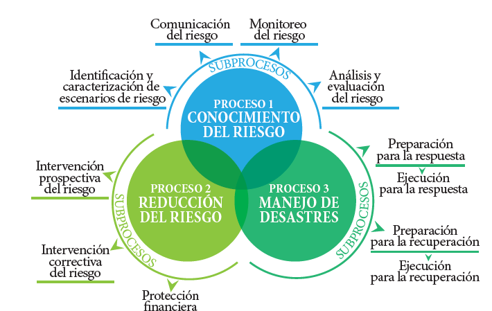{#fig-procesos-subprocesos-grd}

Dentro de la Ley 1523 de 2012 se establece entre otras cosas la conformación de Sistemas de información para la gestión del riesgo de desastres incluyendo los niveles nacionales, regionales, departamentales, distritales y municipales. Dentro del nivel nacional la UNGRD estará a cargo de poner en marcha el Sistema de Información bajo las políticas, estándares y tecnologías que definen la Infraestructura Colombiana de Datos Espaciales. En los niveles restantes el artículo 46 de la ley define lo siguiente: 	

> *“**ARTÍCULO 46. Sistemas de Información en los niveles regionales, departamentales, distritales y municipales.** Las autoridades departamentales, distritales y municipales crearán sistemas de información para la gestión del riesgo de desastres en el ámbito de su jurisdicción en armonía con el sistema nacional, garantizando la interoperabilidad con el sistema nacional y la observación de estándares establecidos por la Unidad Nacional para la Gestión del Riesgo de Desastres.”*

En este sentido se hace necesario adoptar sistemas de información a nivel local, que permitan acceder, procesar, almacenar y analizar datos geoespaciales, los cuales son insumos que contribuyen en todos los procesos de la gestión del riesgo de desastres. El uso de la información geoespacial por sí misma no resulta en la reducción de desastres. Sin embargo, la toma de decisiones a partir del uso de estos datos permite establecer mejores medidas. 

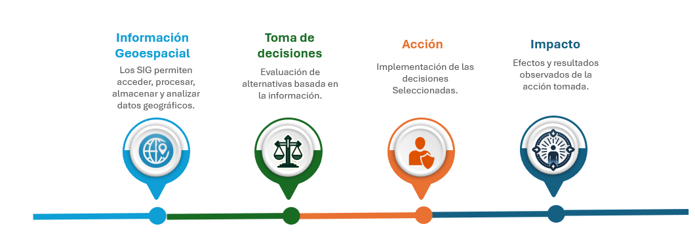{#fig-pasoapaso-sig-grd}

Las tecnologías geoespaciales aportan de manera significativa en todos los fenómenos naturales amenazantes que pueden representar riesgo para la sociedad, de tal manera que se elaboran productos y sistemas para la toma de decisiones. De acuerdo con la Oficina de Naciones Unidas para Asuntos del Espacio Exterior (2013), la información geoespacial puede generar productos y sistemas para el análisis del riesgo, la amenaza y vulnerabilidad de un fenómeno específico, evaluación de daños y sistemas de monitoreo. Además, se evidencia a nivel mundial desde las partes interesadas la importancia del uso de estas tecnologías en fenómenos como inundaciones, sismos, sequías, incendios y movimientos en masa. 

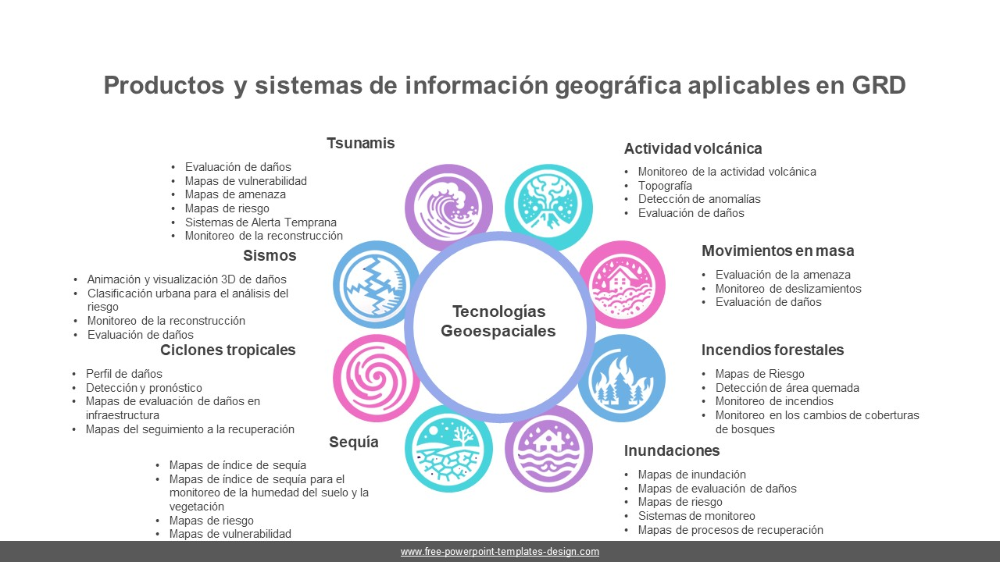{#fig-tecnologias-geoespaciales}

A pesar de la imperativa y evidente necesidad del uso de los SIG para la generación de información que permita mejorar la implementación de cada uno de los procesos de la gestión del riesgo, estas tecnologías no están siendo explotadas en su totalidad. El uso de estas herramientas requiere de responsabilidad institucional, marco normativo y personal capacitado para que este conocimiento pueda ser transferido desde especialistas de las geociencias a profesionales tomadores de decisiones.

Además, el uso de la información geoespacial requiere una inversión significativa en servicios, equipos, licencias, entrenamiento y personal capacitado; por lo tanto, la asignación de recursos se ve impactada por otras necesidades dentro de la gestión de riesgo de desastres. En algunos casos, la capacidad de inversión de las entidades se limita al manejo de emergencias, relegando la adopción de medidas preventivas y de conocimiento.

En el análisis del caso de estudio realizado por la UNOOSA se logró determinar que, con la implementación y el análisis de información geográfica, en la inundación de Namibia del 2009 se podrían haber reducido los daños y pérdidas en un 45%. Por ello, es importante que las entidades locales evalúen opciones de financiamiento y su retorno para herramientas de apoyo en la GRD. Estas no necesariamente deben implicar altos costos, ya que existen instrumentos de bajo costo y herramientas abiertas. 

En conclusión, la integración de los SIG en la gestión del riesgo de desastres representa una herramienta vital para los territorios locales en Colombia. Al aprovechar las capacidades analíticas y de visualización de los SIG, las autoridades y miembros del SNGRD pueden identificar, analizar y evaluar áreas en riesgo, optimizar los recursos, establecer medidas de reducción y mejorar las respuestas en situaciones de emergencia. Esta tecnología no solo facilita una planificación más informada y efectiva, sino que también promueve una participación comunitaria más activa al proporcionar información accesible y comprensible para todos los ciudadanos. 

## 5.1. SIG en Conocimiento del Riesgo

**¿Qué es el conocimiento del riesgo?**

Es el proceso de la gestión del riesgo compuesto por la identificación de escenarios de riesgo, el análisis y evaluación del riesgo, el monitoreo y seguimiento del riesgo y sus componentes y la comunicación para promover una mayor conciencia de este que alimenta los procesos de reducción del riesgo y de manejo de desastre (Ley 1523 de 2012).

**¿Cuáles son los subprocesos que estructuran el conocimiento del riesgo?**

Dentro del conocimiento del riesgo existen cuatro subprocesos derivados que son abordados con el fin de orientar y asesorar la identificación de escenarios de riesgo, el análisis y evaluación del riesgo, el monitoreo y seguimiento del riesgo, y sus componentes, y la comunicación para promover una mayor conciencia de este, alimentando los procesos de reducción del riesgo y del manejo de desastre. A continuación, se presenta un breve resumen de cada subproceso:

- **Identificación y caracterización de escenarios de riesgo:** Es el proceso que busca conocer de manera general, las condiciones de riesgo de un territorio, enfatizando en sus causas y actores, e identificando los principales factores influyentes, los daños y pérdidas que pueden presentarse, y todas las medidas posibles que podrían aplicarse para su manejo (UNGRD, 2017).
- **Análisis y evaluación del riesgo:** Implica la consideración de las causas y fuentes del riesgo, sus consecuencias y la probabilidad de que dichas consecuencias puedan ocurrir. Es el modelo mediante el cual se relaciona la amenaza y la vulnerabilidad de los elementos expuestos, con el fin de determinar los posibles efectos sociales, económicos y ambientales y sus probabilidades (UNGRD, 2017).
- **Monitoreo del riesgo:** Es el proceso orientado a generar datos e información sobre el comportamiento de los fenómenos amenazantes, la vulnerabilidad y la dinámica de las condiciones de riesgo en el territorio.
- **Comunicación del riesgo:** La comunicación de riesgos puede ser considerada una estrategia adaptativa de las comunidades humanas ante la posibilidad inminente de riesgos, y tiene como fin comunicar oportunamente información acerca de la existencia, naturaleza, severidad o aceptabilidad de un riesgo ambiental (UNGRD, 2023).

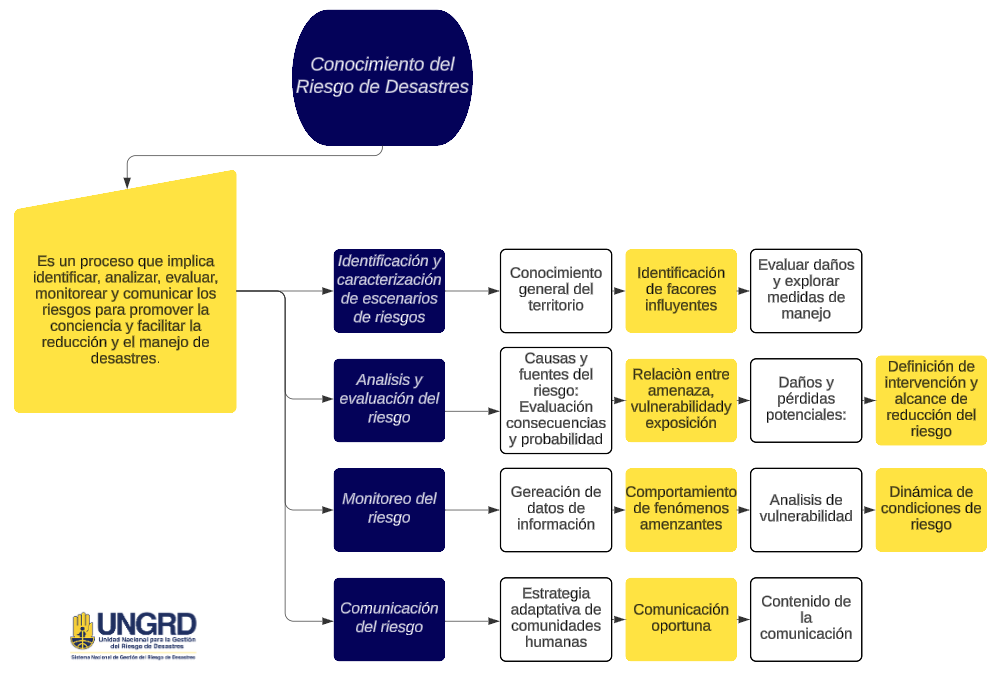{#fig-mapa-conceptual-conocimiento-riesgo}

Como se ha mencionado, a nivel nacional los Sistemas de Información Geográfica se han convertido en una de las herramientas más útiles en el análisis de riesgo de desastres, debido a que han permitido articular y complementar estudios de conocimiento y prevención del riesgo para poder determinar probabilidad, posibles consecuencias y áreas de afectación probable ante la ocurrencia de eventos amenazantes. Así mismo este tipo de herramientas permiten aplicar y diseñar distintas metodologías multicriterio según el tipo de amenaza a evaluar y nos arrojan resultados tales como: riesgo total, vulnerabilidad y prolongación en tiempo y espacio.

- **Análisis de amenaza por factores geológicos, hidrometeorológicos y antrópicos:** Mediante la integración de insumos previos y articulación con técnicas del SIG determinar condiciones de amenaza por diferentes escenarios, los cuales serán insumos priorizados para procesos de delimitaciones de áreas priorizadas y ordenamiento territorial.
- **Estudios básicos y detallados:** Teniendo en cuenta lo expuesto bajo el principio de gradualidad de la ley 1523 de 2012, el uso del SIG será complementario a la formulación y desarrollo de estudios básicos y detallados relacionados con las medidas de intervención, orientadas a establecer restricciones y condicionamientos que contribuyan a la mitigación del riesgo.
- **Delimitación de áreas en condición de amenaza y riesgo:** A partir de análisis puntuales, estudios realizados y herramientas SIG poder delimitar y realizar zonificaciones por amenazas y en base a esto especificar criterios de riesgo y plasmar la información en anexos cartográficos que permitan espacializar las variables estructuradas.

### 5.1.1. Integración de los SIG dentro de los procesos de Conocimiento del Riesgo

La integración de los SIG en los procesos de Conocimiento del Riesgo es fundamental para obtener una comprensión completa y detallada de la relación entre la geografía y los factores de riesgo. Existen aplicaciones para zonificar las amenazas y mediante la incorporación de datos sobre la población, zonificar también actividades económicas o infraestructura expuesta y llevar a cabo evaluaciones preliminares del riesgo.

La justificación para la aplicación de los SIG es mejorar la eficacia y la eficiencia de los análisis de riesgos. Allí predominan aplicaciones para la investigación de amenazas que incluyen fenómenos como deslizamientos y erosiones, tsunamis, incendios forestales, monitoreo de derrames de petróleo y múltiples amenazas.

Algunas ventajas de los SIG en el Conocimiento del Riesgo:

- Apoyo en la identificación de procesos amenazantes, en la evaluación y análisis del riesgo.
- Herramienta eficaz para implementar el monitoreo del riesgo.
- Monitoreo en tiempo real de las condiciones del medio y análisis de cambios instantáneos y progresivos de variables puntuales.
- Conocimiento de las condiciones del medio estudiado en tiempo real y de forma actualizada.
- Relativo bajo costo de implementación y operación.

A continuación, en la @fig-flujo-identificacion-escenarios se evidencia el flujo de trabajo para la implementación de los SIG en los subprocesos de Conocimiento del Riesgo.

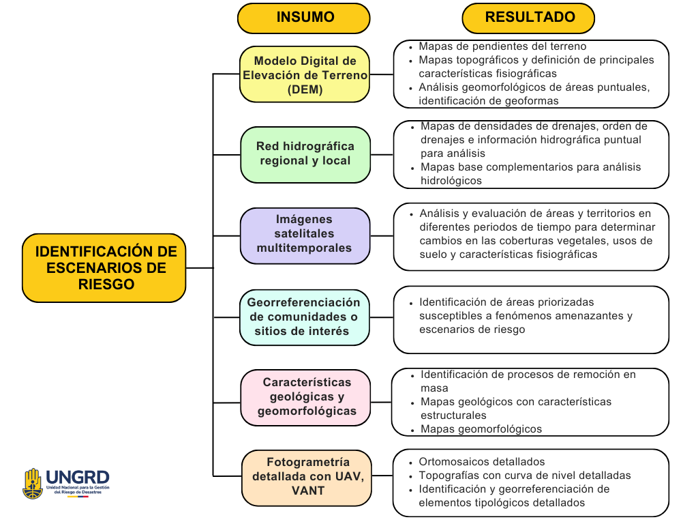{#fig-flujo-identificacion-escenarios}

## 5.2. SIG en Reducción del riesgo

**¿Qué es la reducción del riesgo?**

Es un proceso que busca modificar o disminuir las condiciones de riesgo existentes y evitar nuevos riesgos en el territorio a través de “medidas de mitigación y prevención que se adoptan con antelación para reducir la amenaza, la exposición y disminuir la vulnerabilidad de las personas, los medios de subsistencia, los bienes, la infraestructura y los recursos ambientales, para evitar o minimizar los daños y pérdidas en caso de producirse los eventos físicos peligrosos” (Ley 1523 de 2012).

**¿Cuáles son los subprocesos que estructuran la reducción del riesgo?**

Dentro de la reducción del riesgo existen tres subprocesos derivados que son abordados con el fin de implementar estrategias para reducir los niveles del riesgo, garantizar acciones de prevención ante un riesgo y por último definir instrumentos o mecanismos oportunos para la atención de emergencias. A continuación, se presenta un breve resumen de cada subproceso:

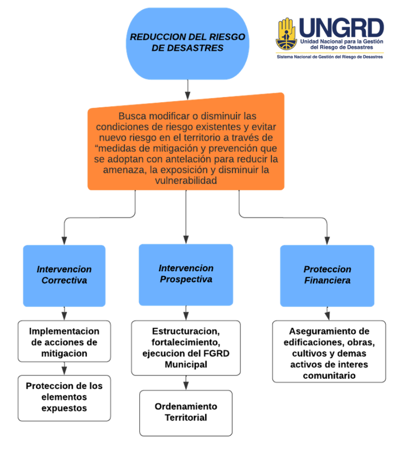{#fig-mapa-conceptual-reduccion-riesgo}

Las condiciones y especificaciones técnicas para la incorporación de la gestión del riesgo en los planes de ordenamiento territorial incluyen el uso de los SIG en los estudios básicos y detallados para la planificación del territorio, así como en la identificación y definición de medidas de intervención y mitigación correspondientes.

- **Ordenamiento Territorial:** La utilidad del SIG radica en la zonificación de variables inherentes dentro del ordenamiento territorial e integración de información espacial que será de utilidad para el conocimiento de un territorio puntual antes y después de un evento de intervención o para futuros escenarios de planificación durante la ejecución de obras de mitigación o el desarrollo de estas.
- **Estudios básicos y detallados:** Teniendo en cuenta lo expuesto bajo el principio de gradualidad de la Ley 1523 de 2012, el uso del SIG será complementario a la formulación y desarrollo de estudios básicos y detallados relacionados con las medidas de intervención, orientadas a establecer restricciones y condicionamientos que contribuyan a la mitigación del riesgo.
- **Medidas de intervención y mitigación del riesgo:** Encaminadas principalmente a la georreferenciación de obras estructurales y no estructurales, la evaluación mediante sensores remotos de las condiciones bióticas y abióticas de un territorio y el uso de los SIG para el monitoreo en tiempo real de los diversos procesos incluidos en el desarrollo de estas medidas de mitigación.

### 5.2.1. Integración de los SIG dentro de los procesos de Reducción del Riesgo

La principal habilidad de los SIG ante la preparación de una emergencia dentro del marco de la reducción de los desastres se basa principalmente en la particularidad de ser aplicado a la planificación y preparación ante un evento de desastre. Un ejemplo de ello podría ser la disponibilidad eficaz de información geográfica digital para apoyar las decisiones de respuesta a desastres y toma de decisiones.

El proceso de integración de los SIG en sinergia con la Reducción del Riesgo de Desastres será un proceso participativo compuesto por los actores en el territorio, quienes serán eje fundamental tanto en la estructuración como en la ejecución y el desarrollo objetivo.

A continuación, se presenta un ejemplo de las ventajas de los SIG en la Reducción del Riesgo de Desastres:

- Fortalecimiento de procesos y productos.
- Apoyo en la planificación y gestión de desastres.
- Fácil accesibilidad a la información.
- Relativo bajo costo de implementación y operación.

El uso de los SIG resulta crucial en el análisis de todas las etapas o fases de los ciclos de desastres, y su aplicación genera mayores beneficios en la planificación del territorio, la prevención y la mitigación. Es necesario, entonces, que los SIG sean integrales e integrados, de manera que resulten efectivos y sostenibles en el tiempo y el espacio (Montilla & Cantaya, 2010).

#### 5.2.1.1. Intervención prospectiva

- **Generación de bases de datos y visores para visualización de información:** Dentro de la intervención prospectiva será útil para recopilar e integrar dentro de los procesos información de ordenamiento territorial, escenarios de riesgo, información de variabilidad climática, áreas con ocurrencia de eventos de desastres, áreas intervenidas, localización de obras y demás variables incluidas dentro de la reducción del riesgo. No obstante, una interfaz de simple acceso, adaptativa y de rápida consulta será fundamental para la respuesta rápida ante múltiples eventos y como apoyo en la toma de decisiones.

- **Integración de información espacial referente a ordenamiento territorial:** Con el fin de generar estrategias y medidas para la reducción del riesgo, es clave la integración de información correspondiente a ordenamiento territorial dentro de los SIG. Esta información estará encaminada a incluir insumos base de tipo cartográfico y espacial de los POT y PBOT en los siguientes apartados:
  - **Vigilancia y control de urbanismo proyectado y en desarrollo:** Para los apartados incluidos dentro del subproceso de intervención correctiva se enfocan directamente hacia la zonificación de áreas restringidas para construcción, zonificación de usos de suelos, control y monitoreo de procesos urbanísticos actuales y proyectados según las capacidades del territorio.
  - **Mapas de expansión urbana y edificaciones:** Este tipo de anexos cartográficos serán de especial interés en las actividades de monitoreo y seguimiento de las actividades de expansión urbana que a su vez serán un insumo para fortalecer los procesos de reducción del riesgo desde el marco de la planificación territorial y el control de expansión urbana sobre áreas con restricciones de tipo ambiental o limitaciones respecto a construcción de vivienda y procesos de asentamientos poblacionales, así mismo tener un control en tiempo real de las dinámicas poblacionales y demográficas respecto a áreas con potencial de amenaza y riesgo.

#### 5.2.1.2. Intervención Correctiva

- **Mapas de localización de obras y proyectos, monitoreo mediante sensores remotos de las obras dispuestas, información de avance y ejecución de estas:** Desde la perspectiva de la inclusión de los SIG esta se basará en la georreferenciación de las obras o proyectos ejecutados, en desarrollo y proyectados para los diversos escenarios de cada territorio; así mismo se podrán generar bases de datos correspondientes a estados de avance, tipo de obra o proyecto, e información relevante relacionada.

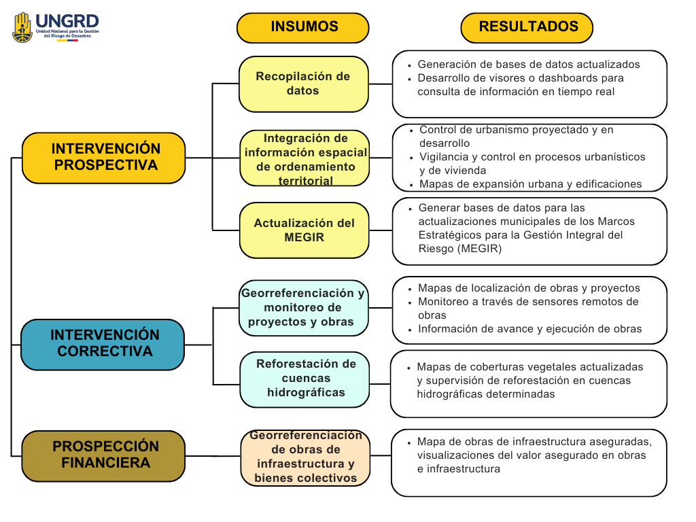{#fig-flujo-reduccion-riesgo}

## 5.3. SIG en el Manejo de Desastres

**¿Qué es el manejo de desastres?**

Es el proceso de la gestión del riesgo compuesto por la preparación para la respuesta a emergencias, la preparación para la recuperación postdesastre, la ejecución de dicha respuesta y la ejecución de la respectiva recuperación, entiéndase: rehabilitación y recuperación (Ley 1523 de 2012).

**¿Cuáles son las acciones dirigidas para el manejo de desastres?**

Dentro del manejo de desastres existen tres acciones derivadas, que son abordadas con el fin de desarrollar previsión y preparación, tendientes a mejorar los mecanismos de respuesta inicial, optimizando los recursos disponibles para la atención oportuna de las emergencias y determinando los mecanismos de articulación y coordinación, a fin de dar respuesta eficiente a las necesidades de la población y el territorio. A continuación, se presenta un breve resumen de cada acción:

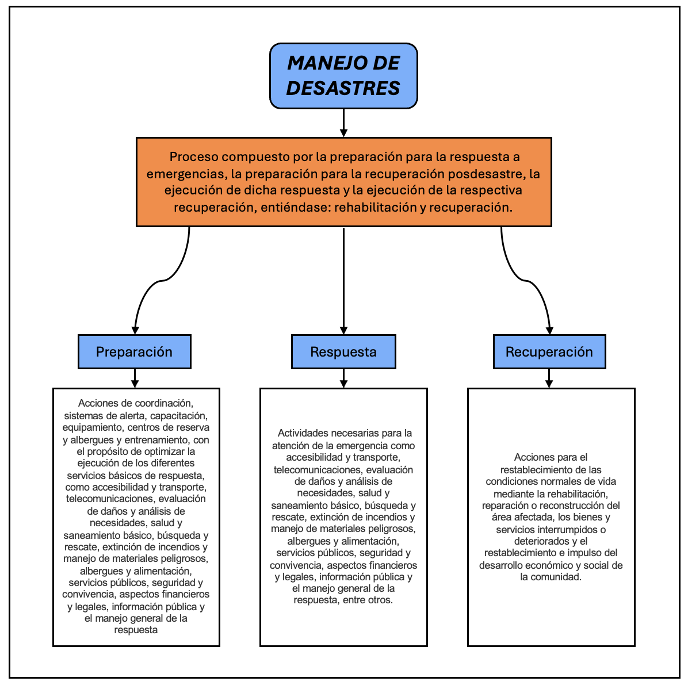{#fig-esquema-manejo-desastres}

### 5.3.1. Integración de los SIG en el Manejo de Desastres

Este subproceso incluye un amplio espectro de actividades que deben ser administradas de una manera adecuada y eficiente, tales como la formulación y ejecución de programas, planes y proyectos relacionados con los desastres en lo referente a su Prevención, Mitigación, Preparación, Respuesta y Recuperación.

Para realizar análisis relacionados al manejo de riesgo utilizando los SIG es necesario contar con tres categorías de información:

1. **Amenazas naturales:** incluye la ubicación, severidad y probabilidad de ocurrencia.
2. **Ecosistemas naturales:** indicando aspectos como los caudales de los ríos, uso de suelo, topografía, etc.
3. **Población e infraestructuras:** proporcionando información para cuantificar el impacto que podría generar un desastre.

Los SIG pueden ser usados para conocer la ubicación de instalaciones críticas vulnerables y facilitar la implementación de los preparativos de emergencia y actividades de respuesta (Organización de los Estados Americanos, 1994). Los usos evidenciados son los siguientes:

- Diseño de rutas de evacuación y ubicación de centros de refugio.
- Seguimiento de las operaciones de respuesta en tiempo real.
- Compartir información con entidades para la elaboración de mapas o visores.

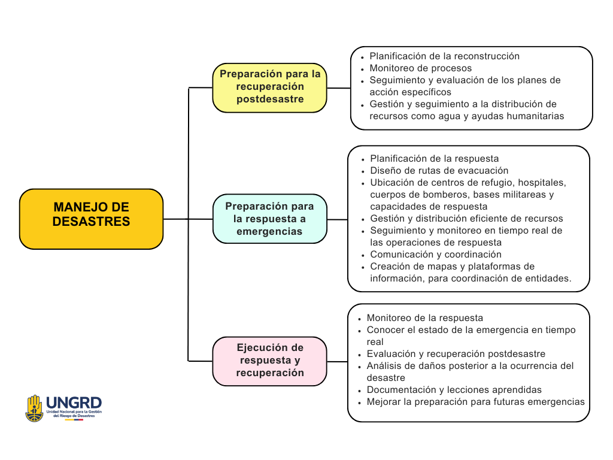{#fig-flujo-manejo-desastres}

## 5.4. Ejemplos de aplicaciones de los SIG en la GRD

El uso de distintas metodologías SIG (reclasificación, teledetección, heurísticas, superposición, entre otras) para el estudio de una misma amenaza abre brechas al momento de realizar el análisis, generando la necesidad de identificar y conocer el diseño de cada una de las metodologías y de esta forma escoger la más idónea para cada amenaza. Se hace necesario conocer los diferentes escenarios de riesgo que a criterio de experto y en concordancia con los SIG han sido utilizados y establecen, según lo que se desea conocer, cuáles serían las más apropiadas según el área de estudio y las variables que se requieren para su correcta aplicación (Luna, 2023).

Con herramientas SIG se han realizado estudios detallados de zonas seleccionadas; por ejemplo, para integrar información acerca de los regímenes de precipitación, la topografía y la capacidad de los cauces de los ríos, con el fin de determinar el impacto máximo de las inundaciones, ubicación de llanuras de inundación o para ubicar proyectos de desarrollo, usos de suelo, tipos de suelo, asentamientos humanos, etc. [@maskrey1998]. Dentro de los procesos de gestión del riesgo de desastres, los SIG se han utilizado como herramientas para llevar a cabo estudios de factibilidad de proyectos específicos de infraestructura e inversión. Las aplicaciones han analizado los sistemas para instalaciones productivas en cuanto a agricultura y asentamientos humanos con el objetivo de definir componentes o segmentos críticos que deberían tener los niveles de riesgos más bajos o que deberían ser priorizados para la reconstrucción después de la ocurrencia de un fenómeno amenazante.

### 5.4.1. Análisis de Sensores Remotos

Dentro de los SIG constituye una herramienta para monitoreo de variables en tiempo real, identificación de cambios en las coberturas terrestres, identificación de escenarios de riesgo geológico, complemento a identificación de cambios puntuales a lo largo del tiempo, categorización de escenarios de amenaza y riesgo.

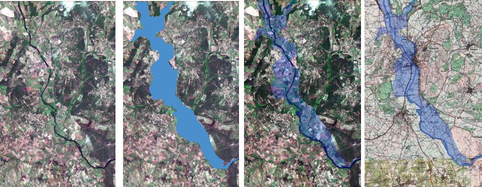{#fig-dinamica-fluvial-multitemporal}

### 5.4.2. Mapa de pendientes a partir de un DEM

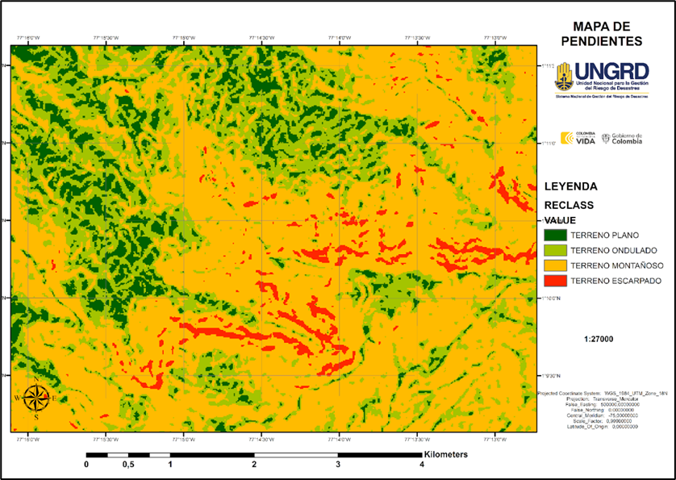{#fig-pendientes-guachucal}

### 5.4.3. Mapa de curvas de nivel a partir de un DEM

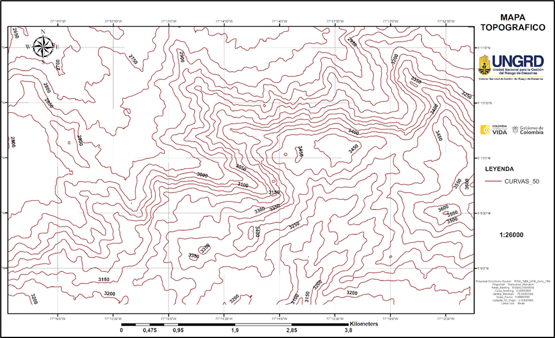{#fig-topografico-abrego}

### 5.4.4. Mapa geomorfológico

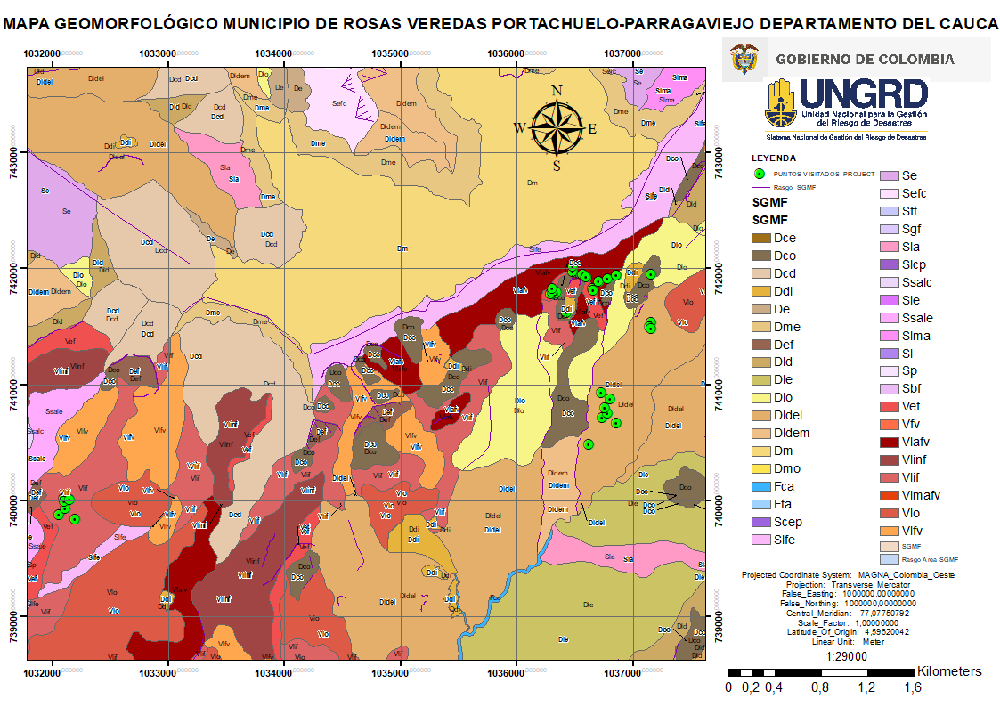{#fig-geomorfologico-rosas-cauca}

### 5.4.5. Imágenes satelitales de radar multitemporales

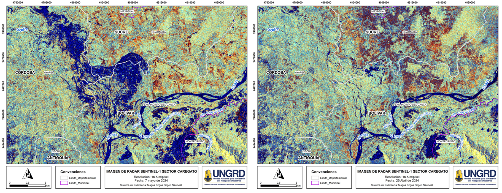{#fig-radar-multitemporal-caregato}

### 5.4.6. Georreferenciación, identificación y sectorización de elementos tipológicos puntuales

::: {#fig-georreferenciacion-guachucal layout-ncol="2"}
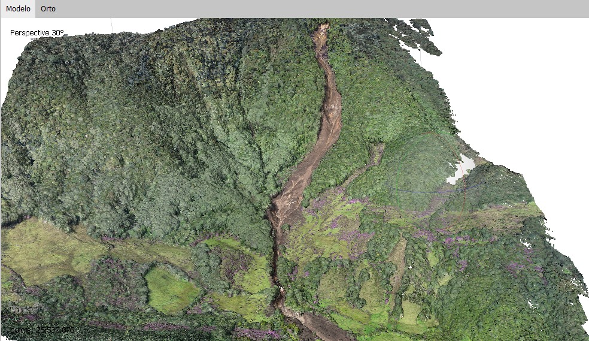

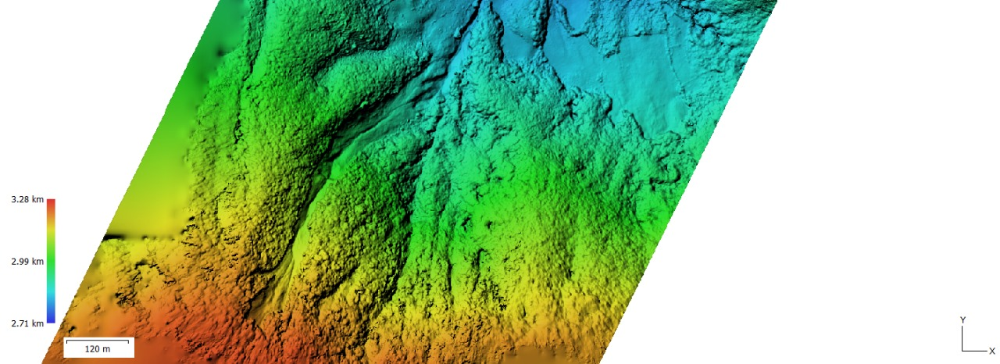

Georreferenciación de drenajes, movimientos en masa y procesos erosivos Microcuenca Quebrada Guachucal, Pasto - Nariño. Fuente: UNGRD, 2024.
:::

### 5.4.7. Insumos complementarios para modelamiento de inundaciones y crecientes súbitas

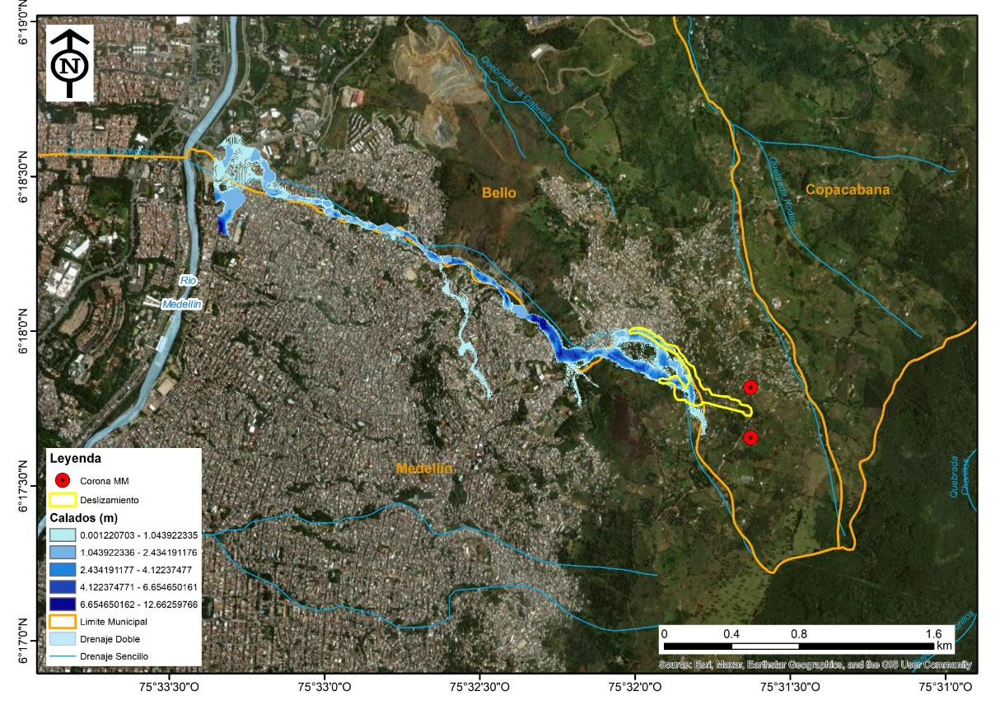{#fig-huella-inundacion-bello}

### 5.4.8. Insumos complementarios para modelamiento de avenidas torrenciales

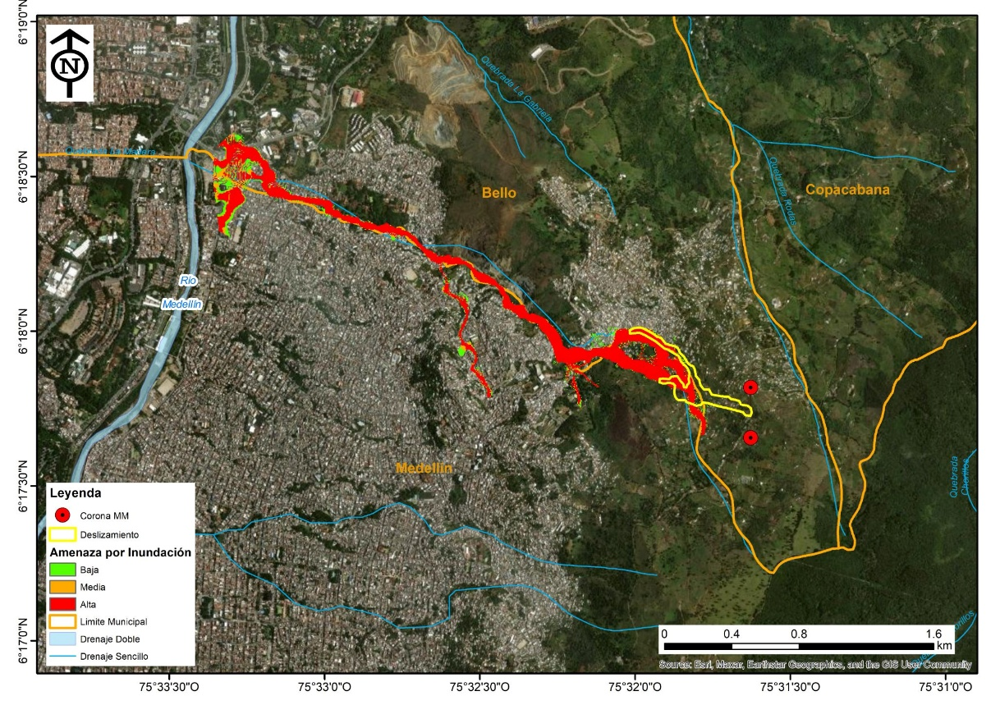{#fig-flujo-avenida-torrencial-bello}

### 5.4.9. Mapa de expansión urbana

](media/05-sig-aplicado-a-la-gestion-del-riesgo/img_07ee1aff.png){#fig-expansion-urbana-aguachica}

### 5.4.10. Mapa de uso de suelo

](media/05-sig-aplicado-a-la-gestion-del-riesgo/img_af0f8219.jpeg){#fig-uso-suelos-bogota}

### 5.4.11. Mapa de coberturas vegetales a partir de imágenes Landsat

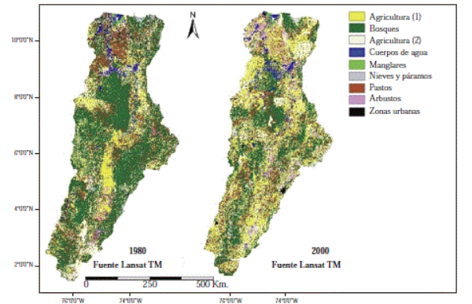{#fig-cambio-uso-suelo-magdalena}

### 5.4.12. Visor de emergencias viales

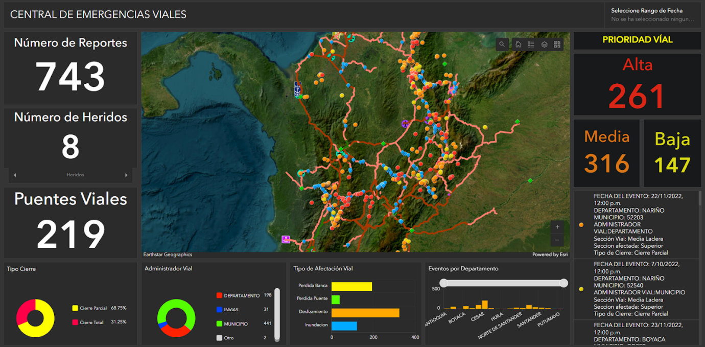{#fig-central-emergencias-viales}

### 5.4.13. Visor de control de inspección a viviendas postdesastre

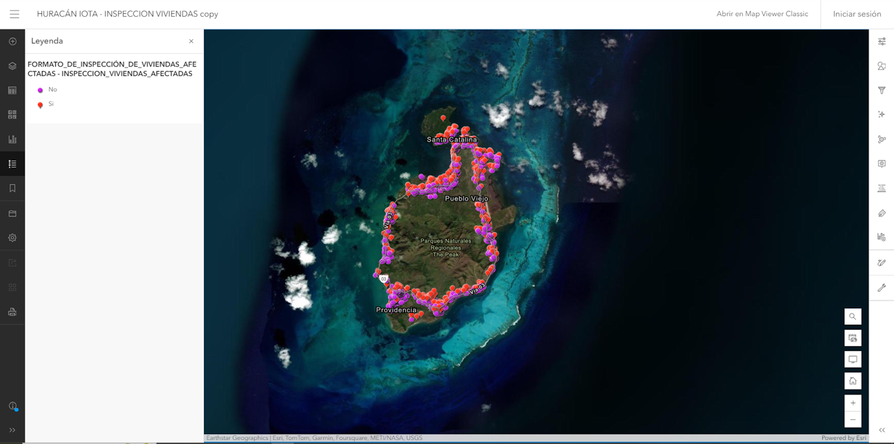{#fig-inspeccion-viviendas-postdesastre}

### 5.4.14. Visor de respuesta ante emergencia volcánica

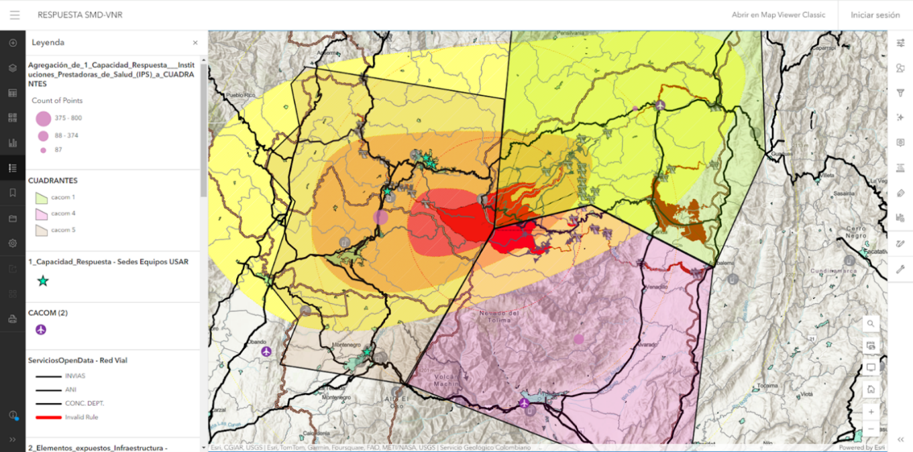{#fig-respuesta-emergencia-volcanica}

### 5.4.15. Visor de erosión costera

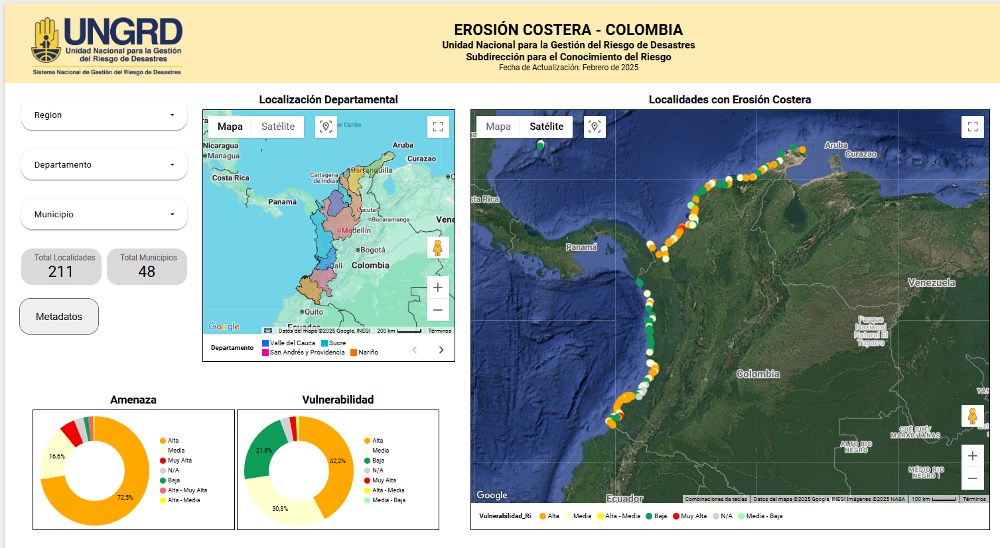{#fig-visor-erosion-costera}

### 5.4.16. Visor de Sistemas de Alerta Temprana

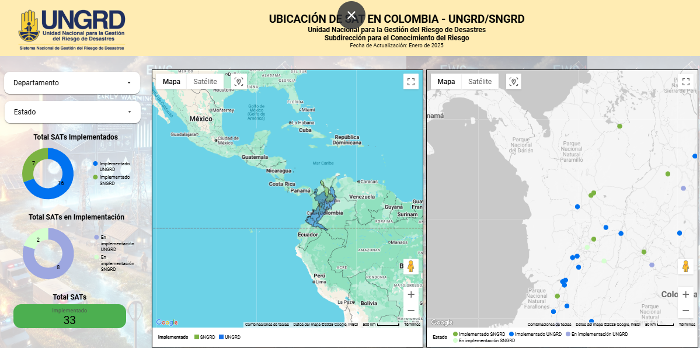{#fig-visor-alerta-temprana}

### 5.4.17. Visor de Instalaciones Industriales con potencial riesgo NATECH y tecnológico

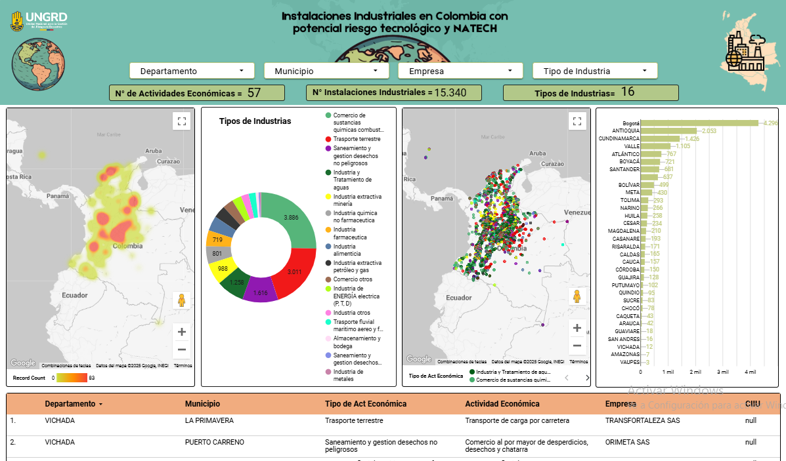{#fig-visor-natech}
