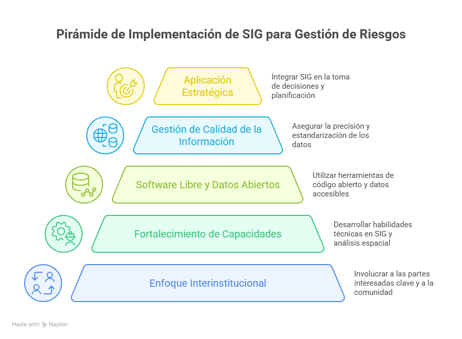

# Recomendaciones generales para un SIG en GRD municipal {.unnumbered}

**Figura ****50****.** Recomendaciones para un SIG municipal. 

Fuente. UNGRD, 2025

**Enfoque interinstitucional y participativo**

Involucrar desde el inicio a las oficinas de planeación, gestión del riesgo, ambiente, salud, educación, servicios públicos y otras dependencias clave.

Establecer articulación técnica con entidades regionales y nacionales como la UNGRD, IDEAM, IGAC, SGC, y autoridades ambientales (CARDER, CAR, entre otras).

Promover la participación comunitaria en la recolección, validación y apropiación de la información geoespacial sobre el riesgo.

**Fortalecimiento de capacidades técnicas**

Conformar equipos técnicos con competencias en SIG, análisis espacial y gestión de datos geográficos.

Realizar procesos de capacitación continua en herramientas como QGIS, Google Earth, servicios interoperables (WMS/WFS), descarga y análisis de datos geoespaciales.

Fomentar el intercambio de experiencias entre municipios para fortalecer aprendizajes y buenas prácticas.

**Uso de software libre y recursos gratuitos**

Priorizar el uso de plataformas como QGIS, SAGA GIS, gvSIG, lo que permite autonomía y sostenibilidad.

Acceder a geoportales oficiales para obtener datos actualizados sin costos (IGAC, ICDE, USGS, Copernicus, IDEAM, etc.).

**Estandarización y calidad de datos**

Definir normas locales para el manejo de información: proyección oficial (MAGNA-SIRGAS), formatos, metadatos, estructura de carpetas.

Asegurar la calidad de la información espacial: evita errores topológicos, inconsistencias en atributos o duplicidades.

Realizar validación en campo como parte del proceso de actualización y verificación de la información.

Documentar cada capa temática con metadatos, fuentes, fecha de actualización y procedimientos aplicados.

Crea manuales de usuario, listas de capas y fichas de productos cartográficos.

**Aplicación**** estratégic****a** **y sostenibilidad del SIG**

Orientar el SIG a generar productos útiles: mapas de riesgo, rutas de evacuación, priorización de inversiones, análisis de exposición.

Integrar el SIG en instrumentos como los POMIUAC, POT, planes de contingencia, y plan de desarrollo.

Establecer responsables técnicos, fechas de actualización, mecanismos de respaldo y almacenamiento ordenado de la información.

