# Anexo 3: Magna Pro

**Implementación de los SIG en la gestión del riesgo de desastres con el Software de uso libre MAGNA SIRGAS PRO 5.1.**

**Contenido**

## Introducción

MAGNA SIRGAS Pro 5.1 es un software especializado desarrollado por el Instituto Geográfico Agustín Codazzi (IGAC) con el propósito de apoyar el trabajo técnico y científico en georreferenciación, cartografía y levantamientos topográficos en Colombia. Está diseñado para garantizar que todas las coordenadas y datos espaciales se ajusten al Marco Geocéntrico Nacional de Referencia – MAGNA-SIRGAS, que es el sistema oficial de referencia geodésica del país.

Su función central es facilitar la conversión, transformación y cálculo preciso de coordenadas en diferentes sistemas y proyecciones cartográficas, permitiendo que la información geográfica pueda ser migrada de diversos sistemas u orígenes de referencia. Con ello, se asegura la compatibilidad e interoperabilidad entre datos provenientes de diversas fuentes, lo que es fundamental para la planificación territorial, la gestión de recursos naturales, la ingeniería y la investigación.

Gracias a estas capacidades, el aplicativo **MAGNA Sirgas Pro-5.1** se ha consolidado como una herramienta clave para entidades públicas, empresas privadas y profesionales de diferentes sectores, brindando soluciones confiables y estandarizadas para las necesidades relacionadas con coordenadas y georreferenciación en Colombia.

Principales funciones del MAGNA Sirgas Pro 5.1

### Cambiar de un sistema de referencia a otro

Permite transformar coordenadas del sistema antiguo (Datum Bogotá) al sistema actual oficial del país (MAGNA-SIRGAS) y viceversa.

### Transformar coordenadas geográficas a planas (y viceversa)

Convierte latitud y longitud (grados) a coordenadas en metros dentro de un plano de proyección oficial, como UTM o Gauss-Krüger.

### Mover coordenadas entre diferentes zonas cartográficas

Permite cambiar coordenadas de una zona UTM o Gauss-Krüger a otra cuando un punto está en otra franja del mapa.

### Ajustar alturas medidas con GPS

Corrige las alturas obtenidas con GPS para que coincidan con las alturas sobre el nivel del mar, usando el cálculo de ondulación geoidal.

### Actualizar coordenadas por cambios en el terreno

Corrige coordenadas antiguas considerando movimientos de la corteza terrestre (por ejemplo, pequeños desplazamientos causados por tectónica).

### Convertir varia coordenadas a la vez

Procesa listas o archivos completos con varios puntos para convertir o transformar coordenadas en una sola operación.

## Guía para la instalación en ordenadores

Para garantizar la obtención de la versión más reciente y segura, el aplicativo debe descargarse únicamente desde el portal oficial del IGAC, en la sección de herramientas geográficas, disponible en el siguiente enlace:

🔗

{#fig-mp-enlace-descarga}

El enlace permitirá descargar un archivo comprimido con extensión (.ZIP) con el nombre ***Magna Sirgas Pro-5.1  ***este archivo contiene todos los elementos necesarios para ejecutar la aplicación, incluyendo el ejecutable principal y la documentación técnica.

## Requerimientos de Hardware

Para garantizar el óptimo funcionamiento del aplicativo Magna Sirgas Pro-5.1, es indispensable que el equipo de cómputo cumpla con ciertos requerimientos técnicos mínimos. Estos requisitos aseguran que el software pueda ejecutarse de forma estable, con tiempos de respuesta adecuados y sin interrupciones durante los procesos de cálculo o visualización de datos geoespaciales.

A continuación, se precisan las condiciones mínimas y recomendadas de hardware para un correcto funcionamiento del aplicativo:

{#fig-mp-hardware-minimo}

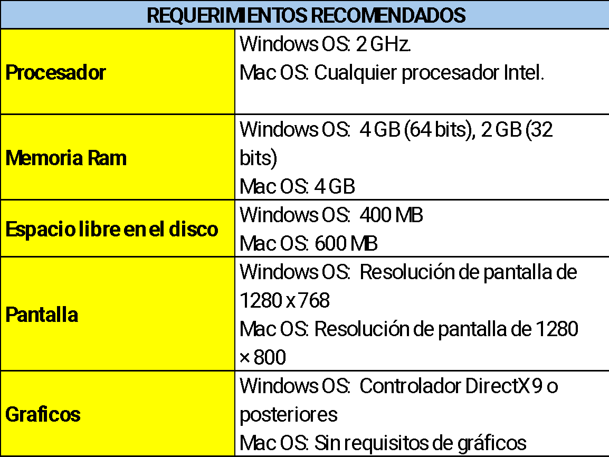{#fig-mp-hardware-recomendado}

### Requerimientos de Software

Para poder ejecutar correctamente la herramienta, es indispensable realizar previamente la instalación del siguiente software, el cual garantiza el funcionamiento óptimo y la compatibilidad del sistema. La ausencia de estos componentes puede generar errores de ejecución o limitar el acceso a determinadas funciones de la aplicación.

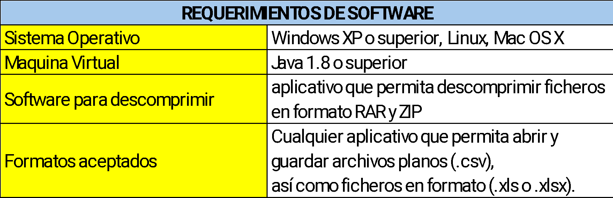{#fig-mp-requerimientos-software}

### Instalación y ejecución

Al descargar el aplicativo desde el enlace anteriormente mencionado, deberá seguir los pasos indicados a continuación, teniendo en cuenta que la herramienta Magna Sirgas Pro-5.1 es un aplicativo portable.

Esto significa que no requiere un proceso de instalación tradicional en el sistema operativo, sino que puede ejecutarse directamente desde la carpeta en la que se encuentre, ya sea en el disco duro del equipo o en un dispositivo de almacenamiento externo. Esta característica facilita su uso en diferentes computadores sin necesidad de configuraciones adicionales.

A continuación, se muestran los pasos para su correcta instalación:

Guarde el archivo en el directorio local de su preferencia, asegurándose de que cuente con todos los permisos de administrador para evitar restricciones de acceso o errores de ejecución. Posteriormente, descomprímalo. Una vez finalizado este proceso, se visualizarán los componentes que conforman la herramienta.
Es importante realizar este paso en una ubicación con permisos completos, ya que algunos archivos del aplicativo podrían requerir privilegios de escritura o modificación durante su funcionamiento.

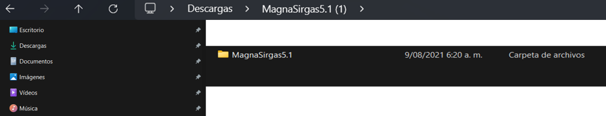{#fig-mp-archivo-descomprimido}

Al descomprimir el archivo encontrara una carpeta denominada ***MagnaSirgas5.1, ***al acceder al directorio encontrara las siguientes subcarpetas:

|  | Carpeta que contiene todos los datos de configuración del aplicativo, así como los manuales de usuario y demás elementos asociados al manejo de la información espacial. |
| --- | --- |
|  | Carpeta que incluye los modelos de archivo que debe usar el usuario para hacer cualquier cálculo masivo. |
|  | Carpeta que comprende la biblioteca de implementaciones funcionales que el programa usa para visualizar y efectuar los procesos de cálculo. |
|  | Fichero (.jar) que permite ejecutar la aplicación para ser usada por el usuario. |

: Subcarpetas contenidas dentro del aplicativo MagnaSirgasPro5.1. Fuente: Autor {#tbl-mp-subcarpetas}

Ejecute el aplicativo haciendo doble clic sobre el archivo ***MagnaSirgas5.jar***.
Es importante asegurarse de que este archivo esté correctamente asociado a Java para que pueda ejecutarse sin inconvenientes. En caso de que no se abra automáticamente, verifique que tenga instalada la versión más reciente de Java Runtime Environment (JRE) y que la extensión (.jar) esté configurada para abrirse con dicho programa, en tal caso el siguiente enlace le permitirá descargar desde la página oficial el complemento de Java para ordenadores .

Finalmente, el aplicativo se abrirá y quedará listo para su uso, permitiendo al usuario operar sus funciones de acuerdo con sus necesidades y requerimientos específicos. Se recomienda familiarizarse con las herramientas y opciones disponibles para aprovechar al máximo sus capacidades.

## Interfaz del aplicativo

La interfaz de **Magna Sirgas Pro 5.1** ha sido diseñada para ofrecer un entorno intuitivo y organizado, que facilite la realización de cálculos y transformaciones geodésicas con precisión. En la parte superior, se encuentra una barra de herramientas con accesos directos a las principales funciones del aplicativo.

El área central corresponde al visor cartográfico, donde se visualizan datos geoespaciales y resultados de los procesos ejecutados. Este diseño permite un acceso rápido a las herramientas y una gestión eficiente de la información georreferenciada.

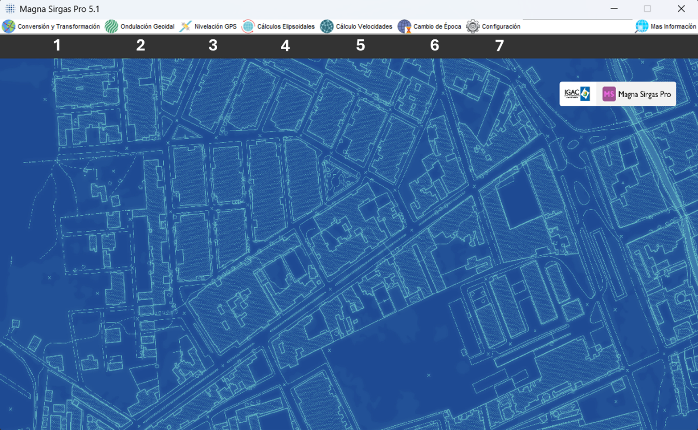{#fig-mp-interfaz-general}

A continuación, se describen las principales funciones de la interfaz del aplicativo:

### Conversión y transformación

Este apartado permite realizar la conversión de coordenadas desde diversos sistemas de origen hacia sistemas de referencia preestablecidos. Asimismo, brinda la opción de crear nuevos orígenes cartesianos, así como editar o eliminar los existentes. Esta funcionalidad resulta especialmente útil para garantizar la precisión en la georreferenciación, facilitando la adaptación de los datos espaciales a diferentes marcos de referencia según las necesidades del proyecto.

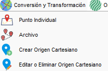{#fig-mp-menu-conversion-transformacion}

Punto Individual Permite realizar la conversión o transformación de coordenadas para un solo punto, ingresando sus valores manualmente. Es útil para procesar datos puntuales sin necesidad de manejar archivos completos.

Archivo Ejecuta la conversión o transformación de coordenadas para múltiples puntos contenidos en un archivo. Ideal para procesar grandes volúmenes de datos de forma automatizada y consistente.

Crear origen cartesiano Genera un sistema de coordenadas cartesiano local a partir de un punto de referencia definido por el usuario. Esto facilita trabajos topográficos o de ingeniería donde se requiere un sistema propio para cálculos precisos.

Editar o eliminar origen cartesiano Permite modificar las características de un origen cartesiano previamente creado o eliminarlo cuando ya no sea necesario, manteniendo actualizada la configuración del proyecto.

### **Ondulación Geoidal**

Sirve para calcular la diferencia entre dos tipos de alturas: la altura medida por GPS (elipsoidal) y la altura real sobre el nivel del mar (ortométrica). Para esto, utiliza modelos geoidales oficiales, que aseguran resultados precisos y confiables. Esta función es muy útil para transformar mediciones tomadas con equipos GNSS en datos compatibles con mapas y referencias oficiales del país. El programa permite trabajar con un solo punto o con varios a la vez, lo que facilita y agiliza el manejo de la información.

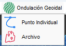{#fig-mp-menu-ondulacion-geoidal}

Punto individual Permite calcular la ondulación geoidal para un solo punto ingresando manualmente sus coordenadas geográficas, planas, geocéntricas, Gauss Kruger o UTM. Este cálculo devuelve la diferencia entre la altura elipsoidal y la altura ortométrica para esa ubicación específica.

Archivo Ejecuta el cálculo de la ondulación geoidal para múltiples puntos contenidos en un archivo, permitiendo procesar grandes volúmenes de datos de forma automática y consistente. Es ideal para proyectos de cartografía, topografía y geodesia que requieren tratamiento masivo de información altimétrica.

### Nivelación GPS

Ayuda a transformar las alturas obtenidas con GPS en alturas reales sobre el nivel del mar. Para lograrlo, aplica correcciones basadas en modelos geoidales oficiales, lo que asegura que los resultados sean más precisos y compatibles con los mapas y referencias usadas en el país. Se puede trabajar con un solo punto o con varios a la vez, lo que permite usarla tanto en mediciones simples como en proyectos más grandes.

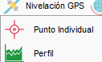{#fig-mp-menu-nivelacion-gps}

Punto Individual Permite para calcular la altura real de un solo punto medido con GPS, ajustándola para que esté referida al nivel del mar. Es muy útil cuando se necesita conocer la altitud de un lugar específico de manera rápida.

Perfil Permite trabajar con varios puntos alineados para mostrar cómo cambia la altura a lo largo de un recorrido. Es ideal para ver la forma del terreno en caminos, senderos o cualquier tramo que se quiera analizar.

### Cálculos Elipsoidales

Sirve para medir distancias y direcciones entre dos lugares, o para encontrar un nuevo punto partiendo de uno ya conocido y siguiendo una dirección determinada. Estos cálculos se hacen usando la forma y tamaño real de la Tierra, lo que permite obtener resultados más exactos. Es una función muy útil para trabajos que requieren conocer con precisión la ubicación y separación entre puntos en el terreno.

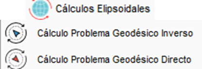{#fig-mp-menu-calculos-elipsoidales}

Cálculo del problema Geodésico inverso Esta herramienta sirve para saber la distancia y la dirección entre dos puntos, partiendo de sus coordenadas. Es muy útil para medir recorridos o conocer cómo se relacionan dos lugares en un mapa.

Cálculo del problema Geodésico Directo De forma contraria si tienes un punto de partida, una dirección y una distancia, te indica dónde estará el punto de llegada. Esto es ideal para planificar rutas o ubicar puntos en terreno.

### Cálculo de velocidades

Permite determinar cómo y cuánto se ha movido un punto en la superficie terrestre a lo largo del tiempo. Esto es útil para monitorear cambios en el terreno, como desplazamientos por actividad tectónica, hundimientos o levantamientos del suelo. Con esta función, se pueden comparar mediciones de diferentes fechas y así conocer la velocidad y dirección del movimiento, lo que ayuda en estudios geológicos, obras de ingeniería y en el seguimiento de redes geodésicas.

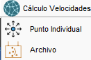{#fig-mp-menu-calculo-velocidades}

Punto individual Permite calcular la velocidad de movimiento de un sitio específico a partir de sus coordenadas y datos asociados.

Archivo Está pensada para procesar varios puntos de forma simultánea, cargando un archivo que contenga la información de coordenadas y fechas para cada uno, lo que agiliza el trabajo cuando se manejan grandes volúmenes de datos. Estas funciones resultan especialmente útiles para el monitoreo de cambios en el terreno, estudios geodésicos y seguimiento de movimientos del suelo.

### Cambio de Época

Esta herramienta permite transformar coordenadas geográficas o cartesianas de una fecha de referencia determinada a otra diferente, teniendo en cuenta el desplazamiento que ocurre por el movimiento constante de la corteza terrestre. Este proceso es fundamental cuando se comparan o combinan datos obtenidos en distintos momentos, garantizando que toda la información se encuentre ajustada a una misma época de referencia. La función es útil en aplicaciones como el seguimiento de deformaciones, la integración de bases de datos históricas y la actualización de información geodésica para estudios y proyectos técnicos.

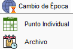{#fig-mp-menu-cambio-epoca}

Punto individual Esta función permite realizar la transformación temporal de coordenadas para un solo punto geográfico. Es decir, ajusta las coordenadas de un punto específico según la variación de la referencia geodésica en diferentes épocas o años, considerando los movimientos tectónicos y otros factores geodinámicos. Esto es útil cuando se necesita actualizar o comparar la posición exacta de un punto en distintos tiempos de referencia.

Archivo Esta herramienta facilita la transformación de coordenadas para un conjunto de puntos contenidos en un archivo, aplicando los ajustes de época de forma masiva. De esta manera, es posible procesar lotes de datos georreferenciados para actualizar sus coordenadas de acuerdo con la evolución temporal del sistema de referencia geodésico. Esto optimiza el trabajo cuando se manejan grandes volúmenes de información que requieren ser ajustados a diferentes épocas.

### Configuración

Esta ventana permite editar los parámetros de visualización de paneles en los módulos de Conversión y Transformación, Ondulación Geoidal, Calculo de Velocidades y Cambio de Época.

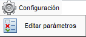{#fig-mp-menu-configuracion}

Es importante destacar que el software **Magna Sirgas Pro 5.1** ofrece una amplia variedad de herramientas geodésicas y cartográficas, incluyendo funciones para la conversión y transformación de coordenadas, cálculo de ondulaciones geoidales, determinación de parámetros elipsoidales, cálculo de velocidades y otras utilidades relacionadas. Esto convierte a **Magna Sirgas Pro 5.1** en una herramienta robusta y versátil para procesar, analizar y gestionar información geoespacial de manera eficiente.

Sin embargo, esta guía se centrará en las funcionalidades orientadas a la conversión y transformación de coordenadas, consideradas fundamentales para el procesamiento y análisis geodésico. De acuerdo con las necesidades específicas de los usuarios, podrá desarrollarse una guía complementaria que aborde el uso de las herramientas avanzadas que ofrece el software.

## Conversión y transformación

En este apartado se presentarán ejemplos explicativos sobre los subprocesos incluidos en la herramienta de conversión y transformación, específicamente en las secciones de: punto individual y archivo.

Cada uno de estos subprocesos será analizado con un enfoque práctico, mostrando cómo aplicar estas funciones para transformar coordenadas de manera precisa y eficiente en diversos contextos geodésicos y cartográficos. Por ejemplo, la opción de “punto individual” permite convertir coordenadas de un solo punto de manera rápida, ideal para correcciones puntuales o verificaciones en campo. La función de “archivo” facilita la transformación masiva de múltiples puntos, optimizando procesos en proyectos de gran escala.

De esta manera, se busca que el usuario comprenda no solo el funcionamiento técnico de cada herramienta, sino también su aplicación en escenarios reales, mejorando la gestión y precisión de la información espacial.

**Punto Individual **

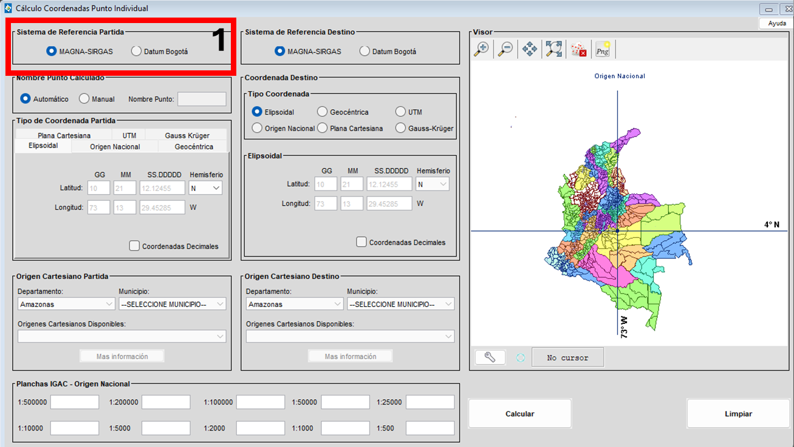{#fig-mp-config-sistema-referencia-partida}

En este apartado se puede configurar el sistema de coordenadas de partida, para este caso se puede seleccionar entre MAGNA SIRGAS y Datum Bogotá, de forma generalizada cada vez que se ajuste el sistema de referencia de partida el visor cambiara de la siguiente manera.

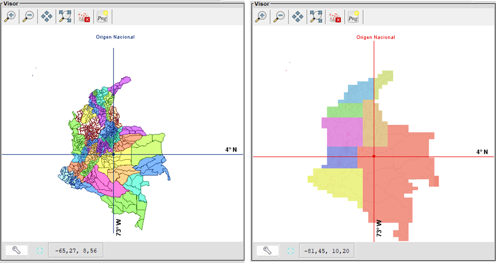{#fig-mp-magna-sirgas-datum-bogota}

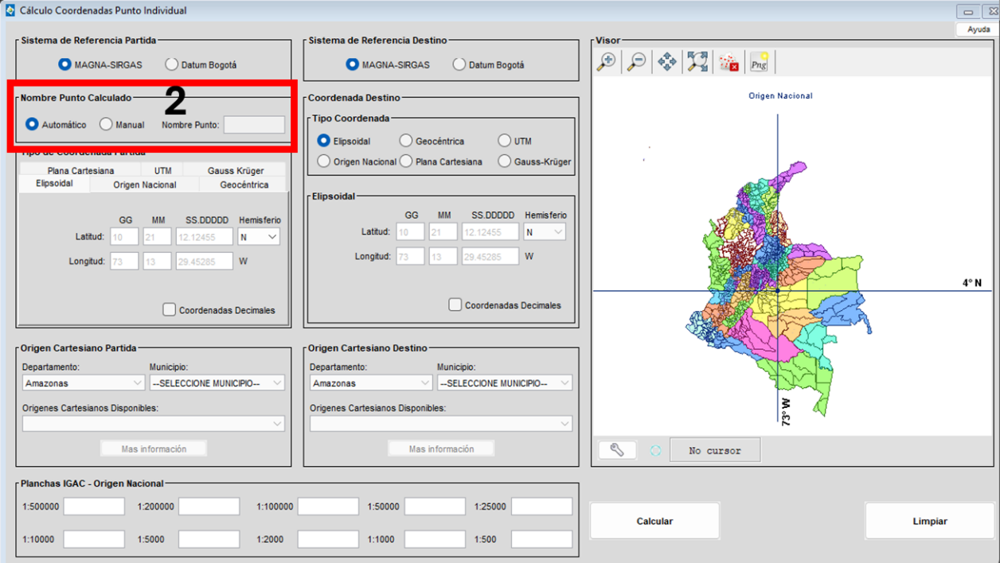{#fig-mp-asignacion-nombre-punto}

Esta casilla permite definir si el software genera automáticamente la codificación de los puntos calculados según la conversión previamente seleccionada, o si, por el contrario, se desea ajustar manualmente la codificación de dichos puntos. Al seleccionar la opción manual, se habilita una casilla adicional llamada ***“Nombre punto”, ***que permite asignar un nombre específico a cada punto. Para el presente caso, utilizaremos la opción manual y nombraremos nuestro archivo como ***"Prueba".***

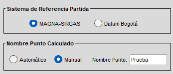{#fig-mp-config-nombre-punto-ejemplo}

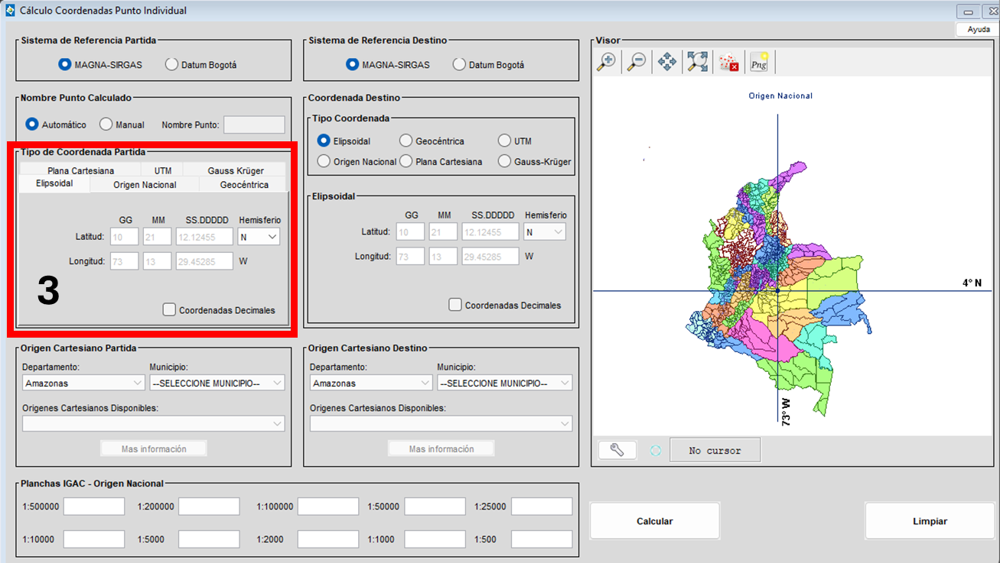{#fig-mp-ingreso-coordenadas-partida}

En este apartado se ingresarán las coordenadas de origen o partida sobre las cuales se desea realizar una conversión o transformación hacia otro sistema de coordenadas, es importante destacar que permite ingresar coordenadas elipsoidales (geográficas), planas cartesianas, Universal Transverse Mercator (UTM), Origen Único Nacional (CTM 12) Y Gauss Kruger. Para el presente ejemplo realizaremos una conversión de coordenadas elipsoidales (geográficas, grados, minutos, segundos).

Nota También posee la opción de activar la casilla Coordenadas decimales en la cual se podrán ingresar coordenadas geográficas (Grados, decimales).

Coordenadas del ejercicio

Latitud 5°42'41.23"N

Longitud 72°47'19.91"W

Así mismo se deberán ingresar las coordenadas en el aplicativo y ejecutar el comando calcular:

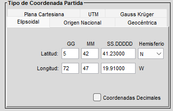{#fig-mp-ingreso-coordenadas-iniciales}

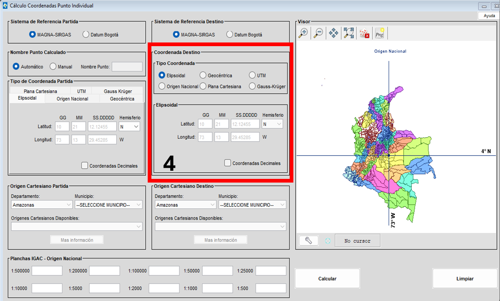{#fig-mp-especificaciones-coordenadas-salida}

En este apartado se configurará el sistema de coordenadas de salida, en el cual se disponen diversos orígenes coordenados elipsoidales (geográficas), planas cartesianas, Universal Transverse Mercator (UTM), Origen Único Nacional (CTM 12) Y Gauss Kruger. Para el presente ejemplo definiremos un sistema de proyección Origen Único Nacional (CTM 12).

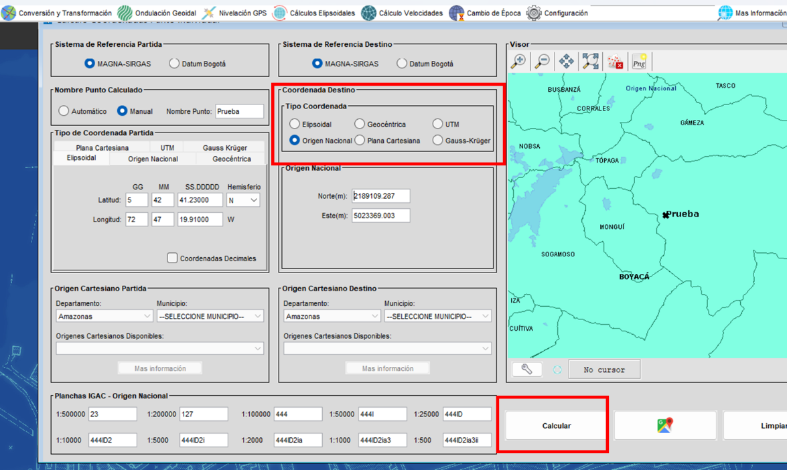{#fig-mp-ejecucion-comando-calcular}

Posterior a la definición del sistema coordenadas de salida se deberá ejecutar el comando calcular con el fin de visualizar las coordenadas de salida y su localización geográfica.

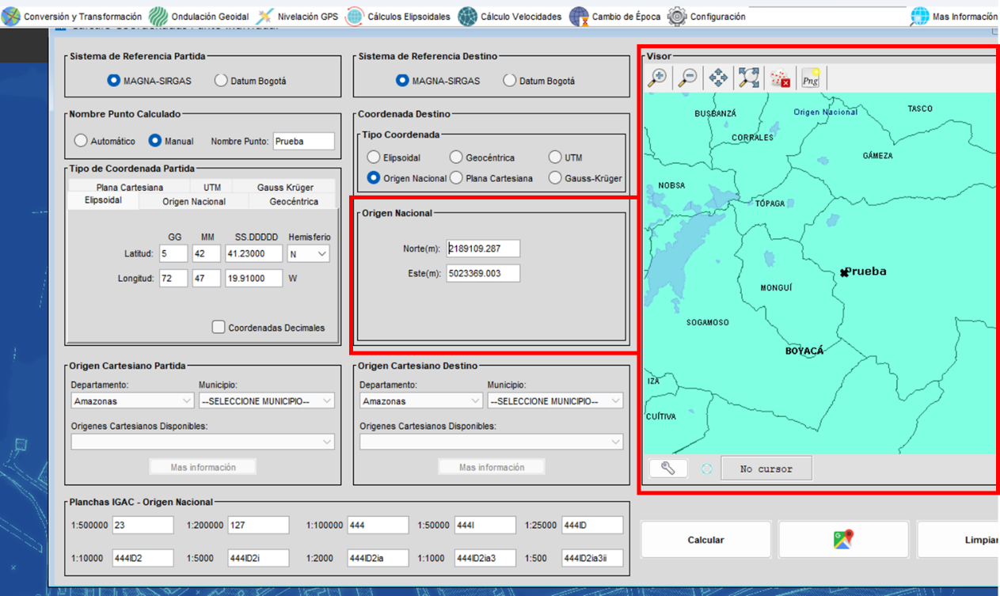{#fig-mp-coordenadas-resultantes}

Si se quisiera realizar la conversión a un sistema de coordenadas plano-cartesianas el proceso es igual al anterior, solo con una ligera variación en el origen cartesiano de destino, como se observa en la siguiente figura:

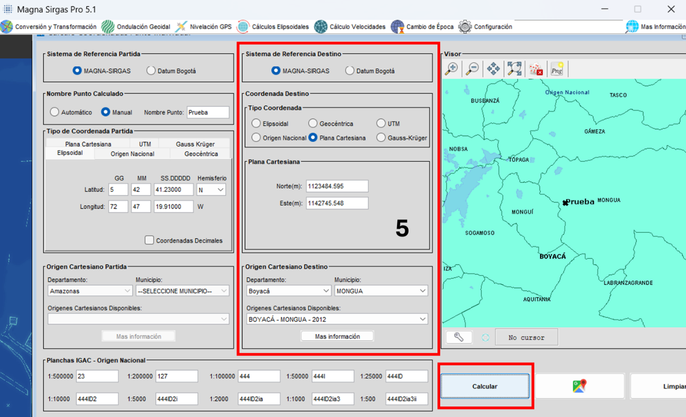{#fig-mp-conversion-plano-cartesianas}

La sección “Origen Cartesiano Destino” del software Magna Sirgas Pro 5.1 permite seleccionar el punto de referencia geodésico oficial que se utilizará como destino en las transformaciones de coordenadas. A través de esta herramienta, el usuario elige el departamento y municipio correspondientes, para luego seleccionar de la lista de orígenes cartesianos disponibles aquel que coincide con la ubicación y época de referencia establecida por el Instituto Geográfico Agustín Codazzi (IGAC). Esta selección garantiza que los cálculos de conversión o ajuste de coordenadas se realicen con base en parámetros geodésicos precisos y actualizados. Además, mediante el botón “Más información”, es posible acceder a los datos técnicos detallados del origen seleccionado, incluyendo coordenadas exactas, datum de referencia y año de establecimiento.

**Archivo**

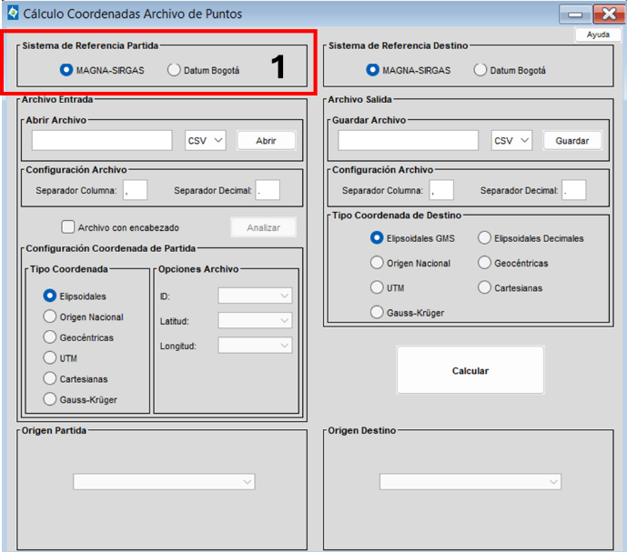{#fig-mp-config-referencia-partida-archivo}

La opción “Sistema de Referencia Partida” del módulo Cálculo Coordenadas Archivo de Puntos en Magna Sirgas Pro 5.1 permite definir el sistema geodésico en el que se encuentran las coordenadas de origen que se van a transformar. El usuario puede elegir entre MAGNA-SIRGAS, que es el sistema de referencia geodésico oficial de Colombia basado en el marco internacional SIRGAS, o Datum Bogotá, un sistema más antiguo usado históricamente en el país. Seleccionar correctamente esta opción es fundamental, ya que determina cómo el software interpretará las coordenadas iniciales y, por lo tanto, influye directamente en la precisión del cálculo y la conversión al sistema de destino. Para el presente ejemplo utilizaremos el sistema Magna Sirgas.

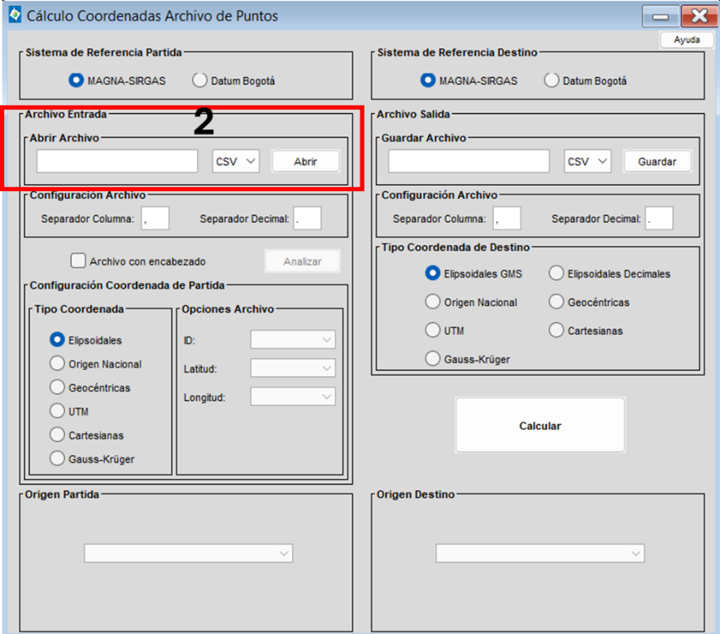{#fig-mp-config-extension-archivo-entrada}

La opción “Archivo Entrada” permite al usuario seleccionar el archivo que contiene las coordenadas iniciales que serán procesadas o transformadas. En este panel se pueden realizar dos acciones principales: **Seleccionar el formato de archivo** mediante un menú desplegable, que admite formatos como CSV, XLS y XLSX. **Abrir el archivo** usando el botón *Abrir*, lo que carga la información en el software para su posterior análisis o conversión. Esta herramienta es esencial para iniciar el proceso de transformación de coordenadas, ya que define la fuente de datos que se usará como base para los cálculos posteriores.

Nota En el archivo Excel se deberán crear las casillas o columnas que seleccionen la identificación de los puntos y sus respectivas coordenadas de la siguiente forma:

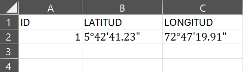{#fig-mp-diligenciamiento-archivo-excel}

Para el siguiente ejemplo realizaremos una conversión de coordenadas Elipsoidales, debido a esto la nomenclatura de las coordenadas se encuentra (Latitud, Longitud) y la extensión del archivo utilizada será (.XLXS).

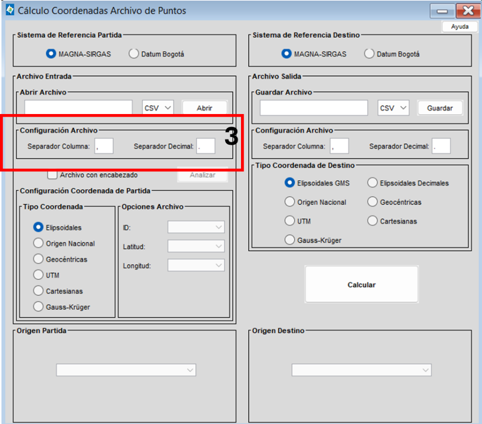{#fig-mp-config-archivo-entrada}

La opción “Configuración Archivo” del módulo Cálculo Coordenadas Archivo de Puntos en Magna Sirgas Pro 5.1 permite establecer los parámetros de lectura del archivo de entrada que contiene las coordenadas a procesar. En este panel se definen dos configuraciones clave: Separador de columna especifica el carácter que se utiliza en el archivo para separar los diferentes campos o datos (por ejemplo, coma “,”, punto y coma “;” o tabulación). Separador decimal indica el símbolo que se emplea para separar la parte entera de la decimal en los valores numéricos (comúnmente punto “.” o coma “,”).

Nota Definir correctamente estos parámetros asegura que el software interprete de forma precisa los datos del archivo, evitando errores de lectura o desalineación de la información.

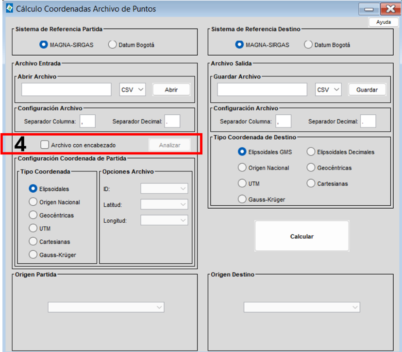{#fig-mp-config-encabezado-archivo}

Permite indicar si el archivo de entrada contiene una fila inicial destinada a los títulos o nombres de las columnas (por ejemplo: *ID*, *Latitud*, *Longitud*). Cuando esta casilla está activada, el software reconoce que la primera fila no forma parte de los datos a procesar, sino que es información descriptiva de cada campo. Junto a esta casilla se encuentra el botón **“Analizar”**, que examina la estructura del archivo y verifica que el formato de las columnas coincida con la configuración establecida, permitiendo detectar posibles inconsistencias antes de realizar la conversión de coordenadas.

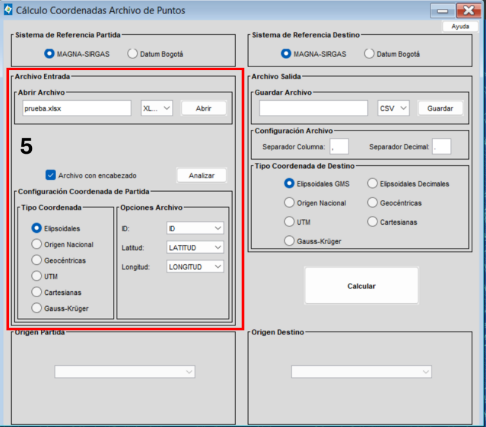{#fig-mp-config-coordenadas-partida-vinculacion}

La sección **“Configuración Coordenada de Partida”** dentro del bloque *Archivo Entrada* en el módulo *Cálculo Coordenadas Archivo de Puntos* de *Magna Sirgas Pro 5.1* permite definir el tipo de coordenadas y la asignación de columnas que contienen los datos de origen a procesar. En Opciones Archivo mediante listas desplegables, se asignan las columnas del archivo que contienen la información de:

**ID** (identificador del punto), **Latitud y  Longitud.** Esta configuración es esencial para que el software interprete correctamente la información cargada y realice la conversión de coordenadas de manera precisa según el sistema de referencia seleccionado.

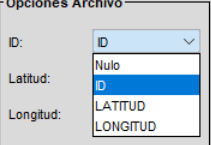{#fig-mp-lista-encabezados}

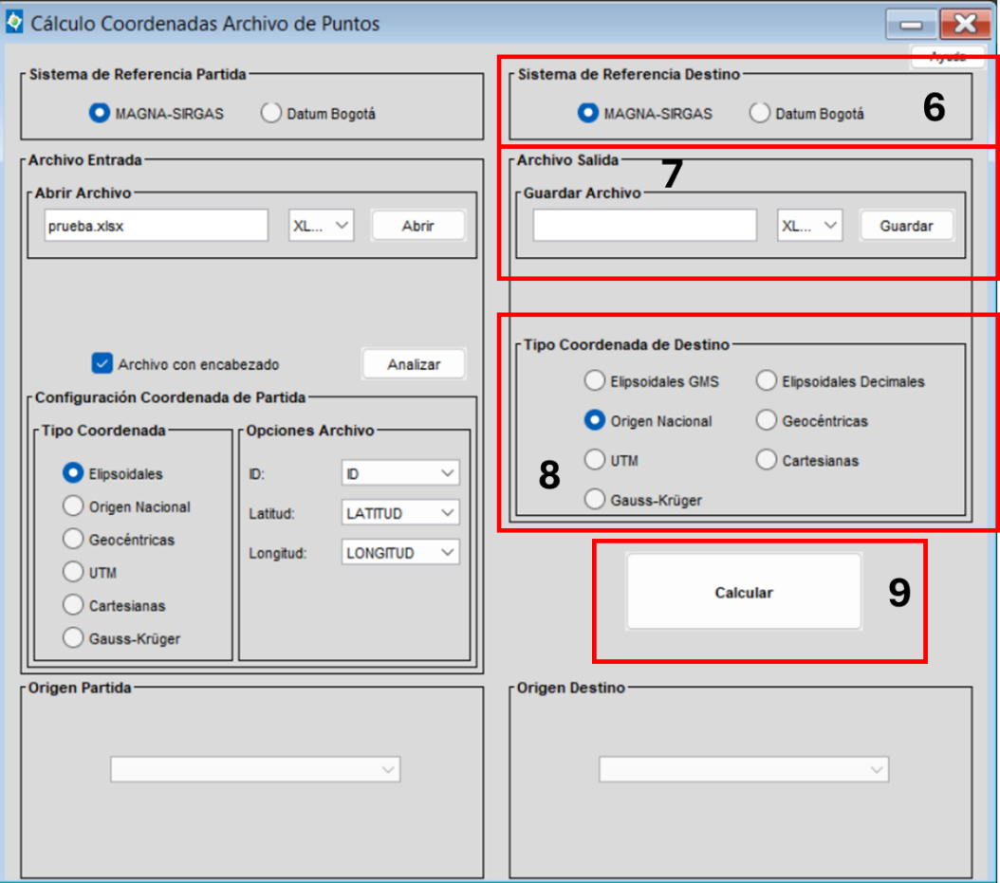{#fig-mp-pasos-coordenadas-salida}

En este apartado se seleccionará el sistema de referencia de las coordenadas de salida producto de la conversión entre las cuales se puede seleccionar: **MAGNA-SIRGAS Y Datum Bogotá, **para el presente a manera de ejemplo se seleccionará el sistema Magna Sirgas.

En archivo de salida se podrá seleccionar la extensión del archivo de salida (CSV, XLS y XLSX) y guardar el archivo de salida en una ubicación especifica, para el presente caso se utilizará la extensión (.XLXS).

En tipo de coordenadas de destino se seleccionará el sistema de referencia al cual se desea convertir las coordenadas de partida, para el presente caso seleccionaremos (Origen Nacional CTM-12).

Por último ejecutamos calcular, visualizaremos los resultados y podremos revisar el archivo de salida generado por el aplicativo.

