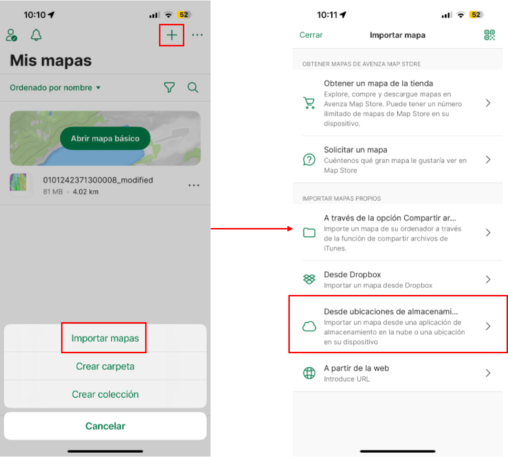
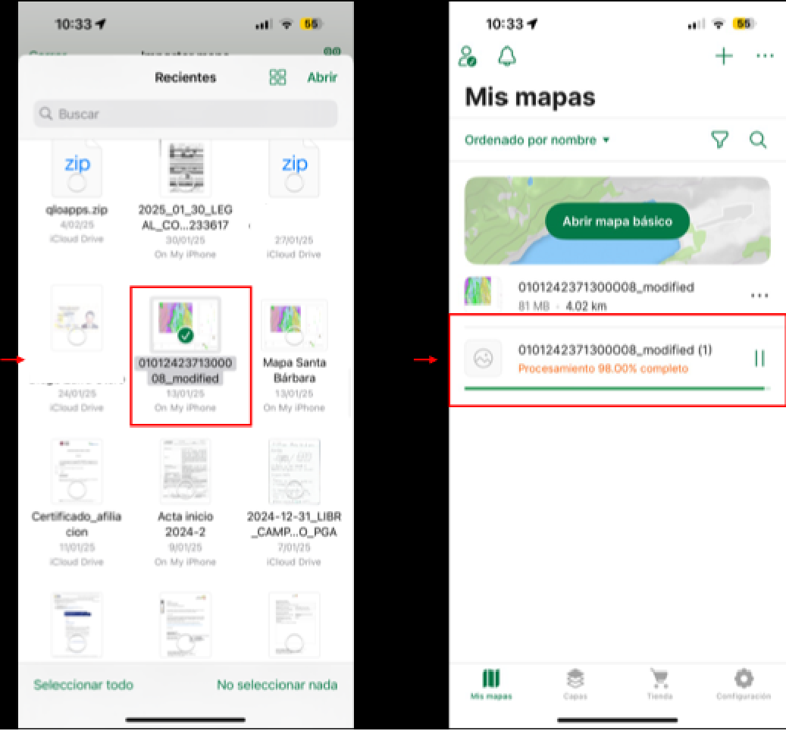
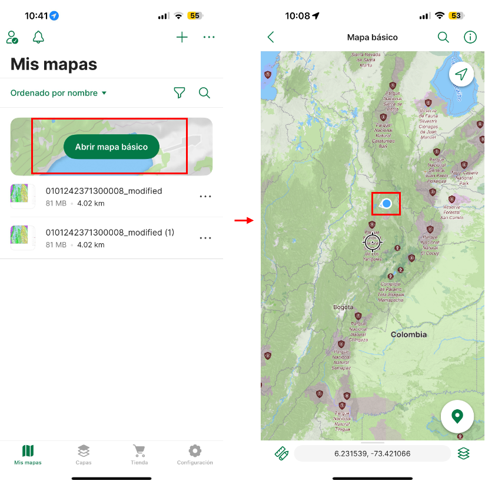
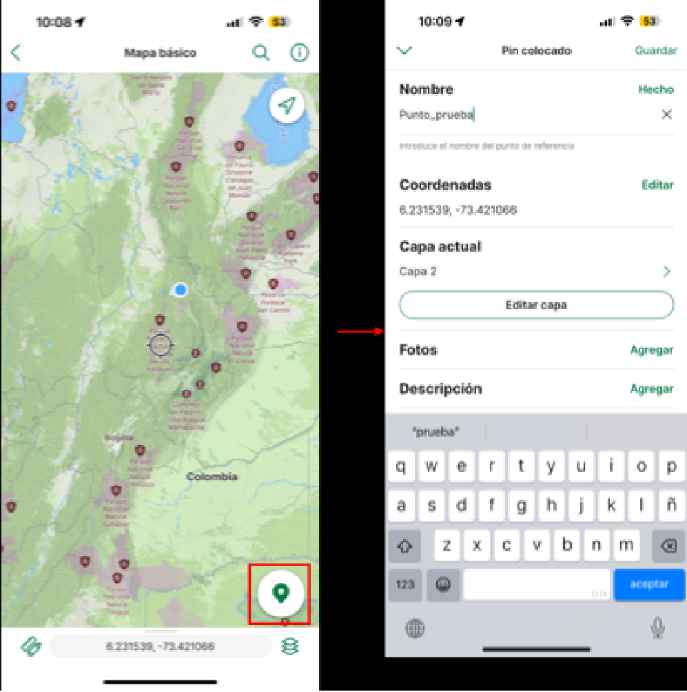
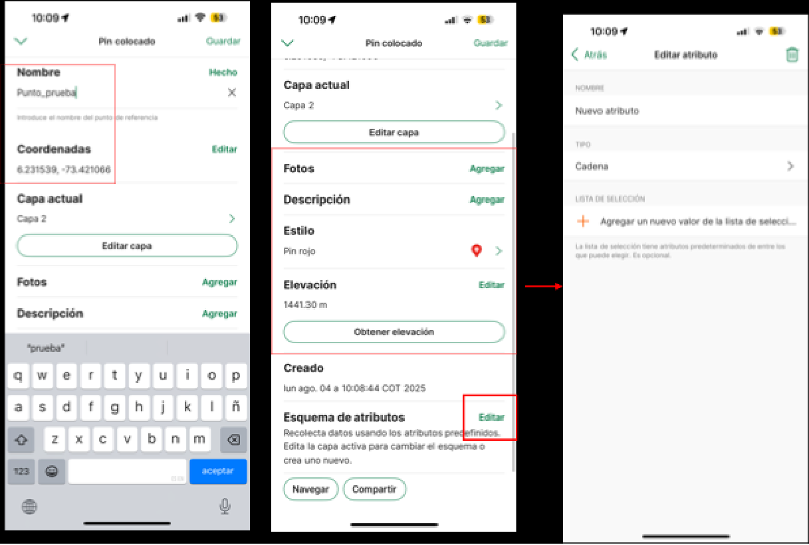
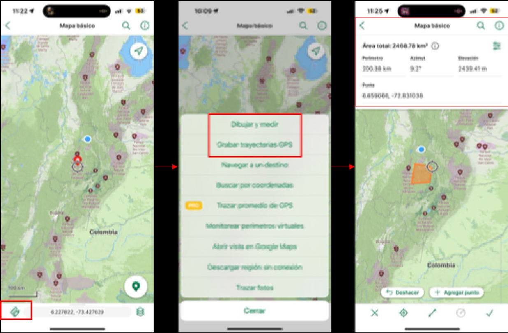
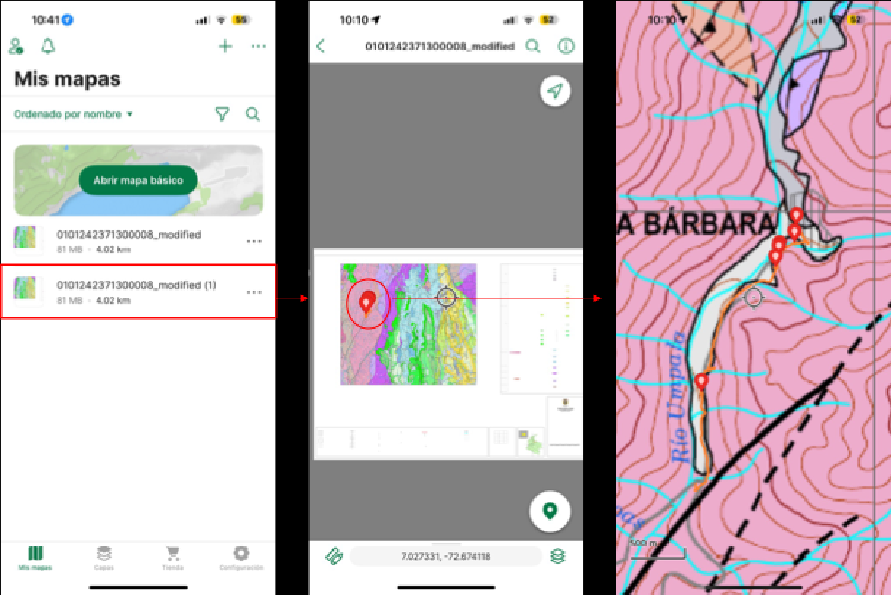
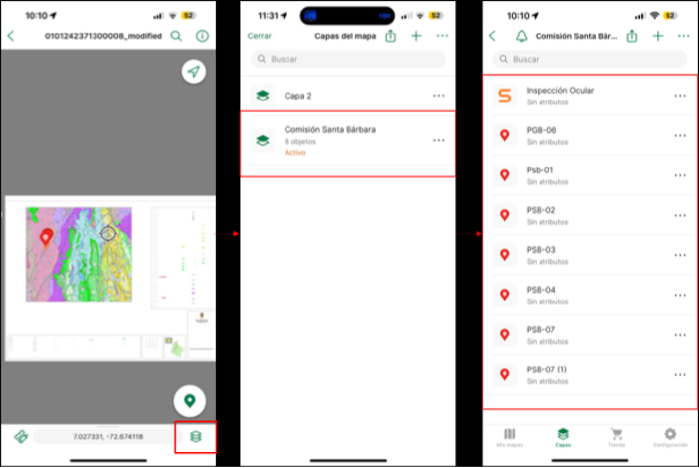
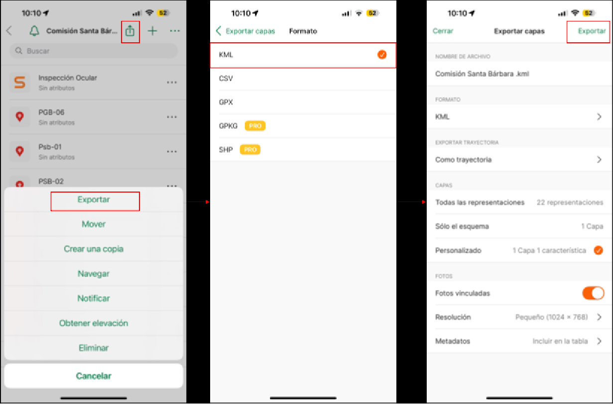
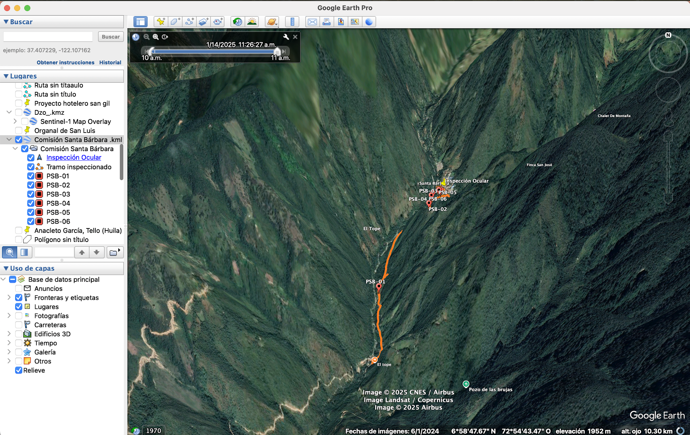

# Anexo 5: Avenza {.unnumbered}

Implementación de los SIG en la gestión del riesgo de desastres con la aplicación de uso libre Avenza 

**Contenido**

**Lista de Figuras**

## ¿Qué es Avenza Maps? {.unnumbered}

Avenza Maps (figura 1) es una app móvil (disponible en Android y iOS) que permite usar mapas georreferenciados en formato PDF o GeoTIFF, incluso sin conexión a internet. Es ideal para navegación en campo, toma de datos y elaboración de informes técnicos.

*Figura 1. Avenza Maps*

Instalación y configuración inicial: 

Para Instalar la aplicación:

En Android: Google Play

En iOS: App Store

Recuerda: esta aplicación requiere activar el GPS y otorgar permisos de ubicación. 

Puedes crear una cuenta (opcional) o usar una cuenta gratuita. Para funciones avanzadas (como importar más de 3 mapas o recolectar shapefiles), considera una suscripción Avenza Pro.

**Preparar el mapa georreferenciado.**

En oficina: 

Crea tu mapa base en ArcGIS, QGIS, AutoCAD, Global Mapper, etc.

Exporta en GeoPDF o GeoTIFF (proyectado en WGS 84 para mejor compatibilidad).

Nombra el archivo con claridad: Mapa_ZonaX_Georreferenciado.pdf

Importar a Avenza:

En la app, pulsa el botón  “Agregar mapa” (figura 2). Después selecciona:

Desde el correo o Google Drive (si te lo enviaron).

Desde “Archivos” si ya lo descargaste.

El mapa aparecerá en tu lista (figura 3).

Tip: Si aparece una advertencia de que no está georreferenciado, asegúrate de que el PDF exportado tenga información espacial.

*Figura 2. Primer paso para insertar un mapa georeferenciado*

*Figura 3. Segundo paso para insertar un mapa georreferenciado*

**Uso en campo: Georreferenciación y recolección de Datos.**

Navegación en tiempo real:

El punto azul muestra tu posición GPS sobre el mapa cargado (figura 4).

Puedes activar “Rumbo” para ver hacia dónde estás orientado.

*Figura 4. Ubicación del usuario en GPS sobre el mapa básico*

Añadir ubicaciones y notas (placemarks):

Pulsa el ícono  y elige “Agregar ubicación” (figura 5).

Asigna un nombre: Ej. Punto_Deslizamiento_01.

*Figura 5. Agregar un punto sobre el mapa*

Agrega atributos y datos adicionales (figura 6):

Fotografía (opcional).

Comentarios (descripción del evento, tipo de suelo, etc.).

Coordenadas (se pueden copiar luego).

Estilo gráfico del punto.

Nuevos atributos a elección (Ejemplo: litología, datos estructurales, uso de suelo).

*Figura 6. Personalización de puntos y listado de atributos*

Genera datos en formato vectorial (figura 7):

Puedes grabar rutas en tiempo real con tu geolocalización en gps.

Dibujar líneas y polígonos personalizados

*Figura 7. Agregar trayectoria GPS y dibujar vectores sobre el mapa.*

Toma de fotos georreferenciadas

Puedes tomar fotos desde Avenza o importar desde galería.

Se asocian automáticamente a los puntos de interés.

Formularios personalizados (Pro)

Si tienes Avenza Maps Pro:

Puedes cargar plantillas CSV para capturar datos estructurados como:

Tipo de evento.

Estado del terreno.

Observaciones técnicas.

Autor y fecha.

**Exportar los datos para informes.**

Ve al mapa usado  ícono de capas  selecciona tus puntos (figura 8 y 9).

*Figura 8. Visualización y selección de datos tomados en el mapa cargado*

*Figura 9. Selección de capas para exportación.*

Elige “Exportar” y selecciona (figura 10):

KML/KMZ (Google Earth) (figura 11)

Shapefile (SHP) (QGIS, ArcGIS)

CSV (Excel)

*Figura 10. Proceso de exportación de capas*

*Figura 11. Visualización de los datos exportados en Google earth*

Envía por correo o guarda en Google Drive.

**Integración en informes técnicos.**

Inserta las coordenadas o mapas en informes de campo.

Asocia las fotos y puntos georreferenciados como anexos visuales.

Convierte los tracks recorridos en líneas o polígonos para análisis espacial.

| Casos de uso comunes en campo | Casos de uso comunes en campo |
| --- | --- |
| Actividad | Ejemplo |
| Mapeo de movimientos en masa | Registrar deslizamientos con fotos y coordenadas |
| Evaluación de riesgo | Marcar puntos críticos en recorridos |
| Inspección de obras | Documentar el avance con geolocalización |
| Geología de campo | Levantar columnas, contactos y estructuras |

**Consejos prácticos**

Carga el mapa antes de salir a campo (la app no necesita señal, pero sí tener el archivo listo).

Usa nombres claros y sistemáticos para puntos (ej.: Erosion_SectorA_01).

Activa el modo avión para ahorrar batería.

Guarda respaldos de los datos al finalizar el día.

¿Qué incluir en un informe técnico usando Avenza?

Mapa con puntos recolectados.

Tabla de datos exportados (coordenadas, observaciones, fotos).

Trayectoria recorrida.

Análisis preliminar según observaciones y georreferencias.

Recursos adicionales

Manual oficial: Avenza Maps Help

Tutoriales en video (YouTube): Canal de Avenza Maps

Formatos personalizables para campo 

