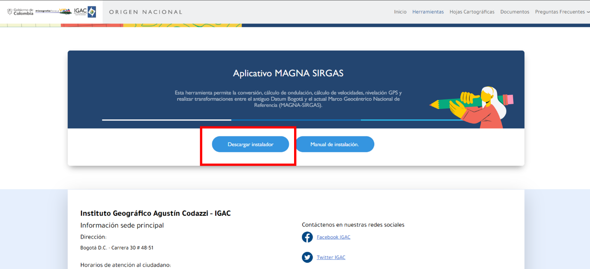

# Anexos {.unnumbered}

::::: {.ungrd-cards-grid}

::: {.ungrd-card}
::: {.ungrd-card-header}
[Anexo 1: Descarga Imágenes Satelitales (QGIS)](Anexo_1_Descarga_Imagenes_Satelitales.html)
:::
::: {.ungrd-card-body}
{class="ungrd-card-img"}

Guía práctica para la descarga de imágenes satelitales y la implementación de Sistemas de Información Geográfica (SIG) utilizando el software libre QGIS para la gestión del riesgo de desastres.
:::
:::

::: {.ungrd-card}
::: {.ungrd-card-header}
[Anexo 2: Google Earth](Anexo_2_Google_Earth.html)
:::
::: {.ungrd-card-body}
{class="ungrd-card-img"}

Manual de configuración y uso de Google Earth, incluyendo la creación de marcas de posición, rutas, superposición de imágenes y perfiles de elevación aplicados a la gestión del riesgo.
:::
:::

::: {.ungrd-card}
::: {.ungrd-card-header}
[Anexo 3: Magna Pro](Anexo_3_Magna_Pro.html)
:::
::: {.ungrd-card-body}
{class="ungrd-card-img"}

Guía para la instalación, configuración e interfaz del aplicativo MAGNA-SIRGAS Pro 5.1., enfocado en los procesos de conversión y transformación de coordenadas geográficas.
:::
:::

::: {.ungrd-card}
::: {.ungrd-card-header}
[Anexo 4: KoboToolbox](Anexo_4_KoboToolbox.html)
:::
::: {.ungrd-card-body}
{class="ungrd-card-img"}

Guía práctica sobre el uso de la plataforma KoboToolbox para el diseño de formularios, recolección de datos en campo y descarga de registros aplicados a municipios.
:::
:::

::: {.ungrd-card}
::: {.ungrd-card-header}
[Anexo 5: Avenza](Anexo_5_Avenza.html)
:::
::: {.ungrd-card-body}
{class="ungrd-card-img"}

Manual introductorio y de uso de la aplicación móvil Avenza Maps para la navegación, orientación y toma de datos cartográficos directamente en terreno.
:::
:::

:::::
